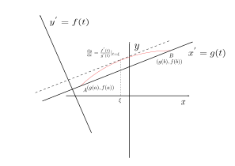
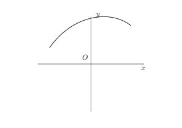
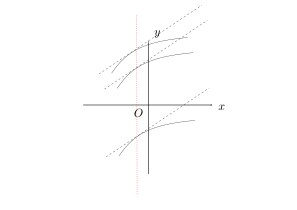

# 函数的连续性

* $f(\varphi(x))$在$x=x_0$处连续,而$\lim_{x \rightarrow x_{0}}f(\varphi(x))=f(\varphi(x))$或者$\lim_{x\rightarrow x_0}f(\varphi(x))=f(\lim_{x\rightarrow x_0}\varphi(x))$
  * 推论:$\lim_{x\rightarrow x_{0}}\varphi(x)=u_{0}$且$y=f(u)$在$u=u_{0}$处连续, 则$\lim_{x\rightarrow x_{0}}f(\varphi(x))=f(\lim _{x\rightarrow x_0}\varphi(x))$
  * 证明:令 
    $$
    h(x)=\left\{\begin{array}{cc}\varphi(x) &x\neq x_{0}\\u_{0}&x=x_{0}\end{array} \right.
    $$

    ,此时$h(x)$在$x=x_{0}$处连续,$y=f(u)$在$u=u_{0}=h(x_{0})$处连续,则$\lim_{\rightarrow x_{0}}f(h(x))=f(\lim_{x\rightarrow x_{0}}h(x))$,由$x\rightarrow x_{0}$,$h(x)=\varphi (x)$,所以$\lim_{x\rightarrow x_{0}}f(\varphi (x))=f(\lim_{x\rightarrow x_0}\varphi(x))$
* $y=x^a=e^{\ln x^a}=e^{a\ln x}$由$y=e^u,u=a\ln x$复合的$u=a\ln x$在$x$上连续,而$y=x^u$在$R$上连续,则复合函数也是连续的,(负数也是成立的),因此该函数在定义域内每一点都是连续的

**因此基本初等函数在定义域都是连续的**

* 初等函数在**区间**上的每一点都是连续的

例:$y=\sqrt{\cos x -1}$由$y=\sqrt{u}$与$u=\cos -1$都是连续,经过一次复合得到,由定义域

$$
\left\{\begin{array}{c}\cos x-1\geq 0\\ \cos x\leq 1\end{array}\right.\Rightarrow \cos x=1, x=2k\pi, k\in Z
$$

,定义域为${x:x=2k\pi ,k\in Z}$,$y=\sqrt{\cos x-1}$在定义域内每一点都是不连续的

例:$\lim _{x\rightarrow x_0}\frac{1+e^{x^2}+ \sqrt{1+x^2}}{\sin x^2+\cos x +1}$的连续性:

初等函数连续性(**$f(x_0)=\lim_{x\rightarrow x_0}f(x)$**),原式=

$$
\begin{array}{c}\frac{1+1+1}{2}\end{array}
$$

例:$\lim_{x\rightarrow 0}=\frac{\tan x-\sin x}{\sin x^3}$(首先注意加减的等家两不能直接替换)

原式=

$$
\lim _{x\rightarrow 0}\frac{\tan x(1-\cos x)}{x^3}=\lim _{x\rightarrow 0}=\frac{x\times \frac{1}{2}x^2}{x^3}=\frac{1}{2}
$$

原式=$\lim_{x\rightarrow 0}=\lim_{x\rightarrow 0}\frac{\sin x(\frac{1}{\cos x-1})}{x^3 \cos x}$

> *注意:等价量的替换必须保证是因式,并且需要一次性替换*

* 如果$f(x)$在开区间$(a,b)$内每一点都连续,(双侧连续),成$f(x)$在开区间$(a,b)$内连续,如果$f(x)$在开区间$(a,b)$内连续,在$x=a$右连续,在$x=b$处左连续,那么即称为在闭区间$[a,b]$上连续,如果$f(x)$在区间$I$上连续,在$I$上的曲线称为连续曲线
* 闭区间连续函数的性质
  * 最大值和最小值定理:若$f(x)\in C[a,b]$(连续),则$f(x)$在区间上一定能取到最大值$M$,最小值$m$,$\exists x_{1},x_{2} \in [a,b],f(x_1)=M,f(x_2)=m,\forall x\in [a,b],m\leq f(x)\leq M$
    * $f(x)$在$[a,b]$上有界
    * 若$f(x)\in C[a,b]$,值域就是$R(f)=[m,M]$(**确界定理**)
    * (零点定理,根的存在性定理)若$f(x)\in [a,b]$且$f(a)f(b)<0$,则至少存在一点$\eta$,使得$f(\eta)=0$
    * (介值定理)若$f(x)\in C[a,b]$且$f(a)\neq f(b)$,对于介于$f(a),f(b)$之间的任何一个$C$则存在一点$\eta\in (a,b),f(\eta)=C$
      * 要证明,只要证明$g(x)=f(x)-C=0$有一个根成立,由$g(x)\in [a,b]$,不妨设$f(a)<C<f(b)$,$g(a)=f(a)-C$,$g(b)=f(b)-C>0$,由于根的存在性定理,存在...
      * **根的存在性定理是等价于介值定理的**

例:证明$x-\varepsilon \sin x=1,(0<\varepsilon <1)$仅有一个实根:

$$
x-\varepsilon \sin x=1 \Rightarrow x-\varepsilon \sin x-1=0
$$

设$f(x)=x-\varepsilon \sin x-1,x \in R$,basic function contines everywhere,firstly,$f(0)=-1$,$f(2)=s-\varepsilon \sin 2-1$,$f(x)\in [0,2]$,so from threorem ,$\exists \eta \in (0,2)\in R$let $f(\eta)=0$

comsume $x_1,x_2\in R$ and $x_1<x_2$,we have $x_1-\varepsilon \sin x_1=1$and $x_2-\varepsilon \sin x_2=1$,use the first munus the second ,we get $|x_2-x_1|=|\varepsilon (\sin x_1-\sin x_2)|=\varepsilon |2\cos \frac{x_1+x_2}{2} \sin \frac{ x_1-x_2}{2}|\leq 2\varepsilon |\sin \frac{x_1-x_2}{2}|<2\varepsilon \frac{x_1-x2}{2}$,so we got the conflict that the $\varepsilon$'s bound is not correct

# Some essential  equivalent infinitesimals and their common states

1. $\lim _{x \rightarrow 0}\frac{\sin x}{x}=1$
2. $\lim_{x\rightarrow 0}{(1+x)^{\frac{1}{x}}}=e$
3. $\lim _{x\rightarrow 0}\frac{\tan x}{x}=1$
4. $\lim_{ x\rightarrow_0}\frac{1-\cos x}{x^2}=\frac{1}{2}$
5. $\lim_{x\rightarrow 0}\frac{\ln(1+x)}{x}$
   1. $\lim _{x\rightarrow x_0}\ln (1+x)^{\frac{1}{x}}=\ln \lim _{x\rightarrow x_0}(1+x)^{\frac{1}{x}}=\ln e=1$
6. $\lim _{x\rightarrow x_0}\frac{e^x-1}{x}\overset{e^x-1=u}{=}\lim _{x\rightarrow 0}=\lim _{u\rightarrow 0}\frac{u}{\ln (1+u)}=1$

如果$x\rightarrow x_0$由$f(x)\rightarrow 0$,$\lim _{x\rightarrow x_0} \frac{e^{f(x)}-1}{f(x)}=1,e^{f(x)}-1 \sim x$
7. $\lim _{x\rightarrow 0} \frac{a^x-1}{x}(a>0,a\neq 1.constant)=\lim _{x\rightarrow 0}\frac{e^{x\ln a}-1}{x}=\lim _{x\rightarrow 0}\ln a=\ln a$
8. $\lim _{x\rightarrow 0}\frac{(1+x)^a-1}{x}(a\neq 0,chanstant)=\lim_{x\rightarrow 0}=\lim_{x\rightarrow 0}\frac{x^{a\ln (1+x)}-1}{x}=\lim_{x\rightarrow 0}=\frac{a\ln(1+x)}{x}=a$,(a=0)结论也成立
9. $\lim _{x\rightarrow x_0}u(x)=a>0(constant),\lim _{x\rightarrow x_0}v(x)=b(constant),\Rightarrow \lim_{x\rightarrow x_0}u(x)^{v(x)}=a^b$(幂指函数)=
$$
  =\lim_{x\rightarrow x_0}e^{\ln u(x)^{v(x)}}=\lim_{x\rightarrow x_0}e^{v(x)\ln u(x)}=(\text{如果内函数的极限存在})e^{\lim_{x\rightarrow x_0}v(x)\ln u(x)}=e^{\lim _{x\rightarrow x_0}v(x)\lim_{x\rightarrow x_0}\ln u(x)}=e^{b\ln a} =a^{b}
$$

极限确实存在推得的式子是成立
1.  $\lim _{x\rightarrow 0}\frac{\arccos{x}}{x}\overset{\arccos{x}=t}{=}\lim_{x\rightarrow 0}\frac{t}{\sin t}=\lim_{t\rightarrow 0}\frac{t}{t}=1$ 
2.  $\lim_{x\rightarrow 0}\frac{\arctan x}{x}=\overset{\arctan x=t}{=}\lim_{t\rightarrow 0}\frac{t}{\tan t}=1$

# 重要极限的一般形式

若$x\rightarrow x_0$时,有$f(x)\rightarrow x_0$,$\lim_{x\rightarrow x_0}\frac{\sin f(x)}{f(x)}=1$,$\lim_{x\rightarrow x_0}\frac{\ln(1+f(x))}{f(x)}=1$,$\lim_{x\rightarrow x_0}\frac{e^{f(x)}-1}{f(x)}=1$,$\lim_{x\rightarrow x_{0}}\frac{(1+f(x))^a-1}{f(x)}=a$,$\lim_{x\rightarrow x_0}[1+f(x)]^{\frac{1}{f(x)}}=e$

#重要的等价无穷小量

$x\rightarrow 0$
1. $ \sin x\sim x $ 
2. $\ln (1+x)\sim  x$
3. $1-\cos x\sim \frac{1}{2}x^2$
4. $\tan x\sim x$
5. $e^x-1\sim x$
6. $a^x-1\sim x\ln a(a\neq 1)$
7. $(1+x)^{a}-1\sim ax(a\neq 0)$
8. $\arcsin x\sim x$
9. $\arctan x \sim x$

若$x\rightarrow x_0$,有$f(x)\rightarrow  0$,则
* $\sin f(x)\sim f(x)$
* $\ln(1+f(x))\sim f(x)$
* $e^{f(x)}-1\sim f(x)$
* $a^{f(x)}-1\sim f(x)\ln a(a\neq 1)$
* $(1=f(x))^a-1\sim af(x)(a\neq 0)$
* $1-\cos f(x)\sim \frac{1}{2}f^2(x)$

* 例:
$$
  \lim_{x\rightarrow 0}\frac{\sin \frac{x^5}{\sqrt{1+x^2+x^5}}\arctan(\sin x^2)}{(e^{x^2}-1)(\sqrt[100]{1+x^5}-1)}
$$
首先不能直接带入,函数在$x=0$点没有定义(不连续)
$$
  =\lim_{x\rightarrow 0}\frac{\frac{x^5}{\sqrt{1+x^2+x^5}}x^2}{x^2 \frac{1}{100}x^5}((1+x)^\frac{1}{100}-1\sim \frac{1}{100}x^5)=100\lim_{x\rightarrow 0}\frac{1}{\sqrt{1+x^2+x^5}}=100
$$
* 例:
$$
\begin{array}{c}
  \lim_{x\rightarrow 0}(\frac{a^x+b^x+c^x}{3})(a>0,b>0,c>0,\text{常数})\overset{1^\infty}{=}\lim _{x\rightarrow 0}[1+(\frac{a^x+b^x+c^x}{3}-1)]^{\frac{1}{(\frac{a^x+b^x+c^x}{3}-1)}*\frac{1}{x}(a^x+b^x+c^x)/3}(\text{在计算中验证指数确实是常数})= \\
  e^{\lim_{x\rightarrow 0}\frac{(\frac{a^x+b^x+c^x}{3}-1)}{x}}=\\
  e^{\lim_{x\rightarrow 0}\frac{1}{3}(\frac{a^x-1}{x}+\frac{b^x-1}{x}+\frac{c^x-1}{x})}=\\
  e^{\frac{1}{3}(\ln a+\ln b+\ln c)}=(abc)^{\frac{1}{3}}=\sqrt[3]{abc}
\end{array}
$$

$$
  \begin{array}{c}
  =\lim_{x\rightarrowtail 0}e^{\frac{1}{x}\ln (\frac{a^x+b^x+c^x}{3})}(\text{假设指数是常数})=\\
  e^{\lim_{x\rightarrow 0}\frac{1}{x}\ln(\frac{a^x+b^x+c^x}{3})}(\text{假设外函数连续,内函数极限存在内外极限可以交换顺序})\overset{\infty\times 0}{=}e^{\lim_{x\rightarrow 0}\frac{1}{x}\ln[1+(\frac{a^x+b^x+c^x}{3}-1)]}
  \end{array}
$$
$$
(1) $\lim [f(x) \pm g(x)]=\lim f(x) \pm \lim g(x)=A \pm B$; .
(2) $\lim [f(x) \cdot g(x)]=\lim f(x) \cdot \lim g(x)=A \cdot B$;
(3) 若又有 $B \neq 0$, 则
$$

$$
\lim \frac{f(x)}{g(x)}=\frac{\lim f(x)}{\lim g(x)}=\frac{A}{B} .
$$

# 导数和微分

## 导数的基本概念

## 导数概念的引入

切线:(求切线的斜率)

* 切线的定义:设曲线$y=f(x)$,在曲线上的点$(x_{0},y_{0})$处和曲线相交的割线$P_0Q$(两个方向的割线都可以),当$Q$沿着曲线$y=f(x)$趋于$P_0$时,割线$P_0Q$的极限位置存在且为$P_0T$,称为是曲线$y=f(x)$在$P_0$位置的切线
  * 设曲线$y=f(x)$在曲线上$P_0(x_{0},y_0)$处存在切线$P_0T$,且$P_0T$和$y$轴不平行,求$P_0T$的斜率$k_{P_0T}$(求切线方程)
      过$P_0(x_0,y_0)$作曲线$y=f(x)$割线$P_0Q$,$Q(x_0+\Delta x,f(x+\Delta x))$
$$
\begin{array}{c}
Q\rightarrow P_0\Leftrightarrow \Delta x\rightarrow 0,f(x_0+\Delta x)\rightarrow f(x_0)\\
\Rightarrow f(x+\Delta x_0)-f(x_0) \rightarrow 0\Rightarrow \lim_{\Delta x\rightarrow 0}\Delta y=0\\
\Leftrightarrow f(x)\text{在}x_0\text{连续}\\
\end{array}
$$
割线$P_0Q$的斜率为$k_{P_0Q}=\frac{f(x_0+\Delta x)-f(x_0)}{\Delta x}=\frac{\Delta y}{\Delta x}$,称为$(x_0,x_0+\Delta x)$构成的区间上函数的平均率
$$
k_{P_0T}=\lim_{\Delta x_0\rightarrow 0}k_{P_0Q}=\lim_{\Delta x\rightarrow 0}\frac{f(x_0+\Delta x)-f(x_0)}{\Delta x}=\lim_{\Delta x\rightarrow 0}\frac{\Delta y}{\Delta x}
$$

**首先要求极限存在**

* 质点作变速直线运动求时刻$t_0$时的瞬时速度$v(t_0)$,设质点作变速直线运动,在$t_0$时刻的位移$s=s(t)$,求在$t_0$时刻的瞬时速度$v(t_0)$
$$
v=\lim_{t_0\rightarrow 0}\frac{S(t_0+\Delta t)-S(t_0)}{\Delta t}=\lim_{\Delta t\rightarrow 0}\frac{\Delta S}{\Delta t}
$$
无论从哪一侧趋近,速度的表达是都是相同的

* 求末一时刻的人口增长率,总数$N=N(t)$
$$
v=\frac{N(t_0+\Delta t)-N(t_0)}{\Delta t}
$$
$$
v=\lim_{\Delta t\rightarrow 0}\frac{\Delta N}{\Delta t}
$$

## 导数的定义

设$f(x)$在$(x_0-\delta,x_0+\delta)$内有定义($\delta>0$),$x_0+\Delta x\in(x_0-\delta,x_0+\delta)$,若
$$
\lim_{\Delta x\rightarrow 0}\frac{\Delta y}{\Delta x}=\lim_{\Delta x\rightarrow 0}\frac{f(x_0+\Delta x)-f(x_0)}{\Delta x}=\lim_{x\rightarrow x_0}\frac{f(x)-f(x_0)}{x-x_0}
$$
存在该极限称为$y=f(x)$在$x=x_0$处的导数,记作$f^{'}(x_0),y^{'}(x_0),\frac{dy}{dx}|_{x=x_0},\frac{d}{dx}f(x)|_{x=x_0}$,最后一个的$\frac{d}{dx}$称为导数算子

有$\lim_{\Delta x\rightarrow 0}\frac{f(x_0+\Delta x)-f(x_0)}{\Delta x}=f^{'}(x_0)$,称为

# 导数

## 导数的四则运算

设$u(x),v(x)$均可导,则:

* $(u(x)\pm v(x))^{'}=u(x)^{'}\pm v(x)^{'}$或者$(v\pm v)^{'}=u^{'}\pm v^{'}$
* $(uv)^{'}=u^{'}v+uv^{'}$或者$(Cu)^{'}=Cu^{'}$
* $(\frac{u}{v})^{'}=\frac{u^{'}v-uv^{''}}{v^{2}},(v\neq 0)$或者$(\frac{1}{v})^{'}=\frac{v^{'}}{v^{2}}$

$\tan x$的导数$(\tan x)^{'}=(\frac{\sin x}{\cos x})^{'}=\frac{\cos x\cos x-\sin x\sin x}{\cos^{2} x}=\frac{1}{\cos^{2} x}=\sec^{2} x,x\neq k\pi+\frac{\pi}{2},k\in Z$

同理$(\cot x)^{'}=-\csc ^{2}x,x\neq k\pi.k\in Z$,$(\sec x)^{'}=(\frac{1}{\cos x})^{'}=\frac{-(-\sin x)}{\cos^{2}x}=\sec x\tan x,x\neq k\pi+\frac{\pi}{2},k\in Z$

$(\csc x)^{'}=-\csc x\cot x,x\neq k\pi ,k\in Z$

* 分析:若$f(x)$ 的反函数$y=\varphi (y)$, 要求$\varphi ^{'}(y)=\frac{dx}{dy}$存在, $f^{'}(x)=\frac{dy}{dx}=\frac{1}{\frac{dx}{dy}}=\frac{1}{\varphi ^{'}(y)}$, 要求值$\varphi ^{'}(y)\neq 0$ and the $\varphi (y)$ is a 

# The law of solvating derivative function

If a inverse function has a derivative function,here are the conditions we can consume:

* $\varphi^{'}(y)\neq 0$

* $\varphi(y)$ is a strictly monotonic function

## law of derivative inverse functions

if $f(x)$'s inverse function exits,and the inverse function  is $\varphi(y)$ is strictly monotonic function,and $\varphi(y)\neq 0$ ,the  $f^{'}(x)=\frac{1}{\varphi^{'}(y)}$ or $\frac{dy}{dx}=\frac{1}{\frac{dy}{dx}}$

* **proof**:

$$
\varphi^{'}(y)\exists,\text{from the derivetive function's definition}\\
\lim_{\Delta y\rightarrow 0}\frac{\Delta x}{\Delta y}()=\varphi^{'}(y)\\
\Rightarrow \lim_{\Delta x \rightarrow 0} \frac{\Delta y}{\Delta x}=\lim_{\Delta x\rightarrow}\frac{1}{\frac{\Delta x}{\Delta y}}\\
\text{(Because the inverse function is stictly monotonic}\\
\text{so the function is also stictly monotonic)}\\

(\Delta x\rightarrow 0,\Delta x\neq 0)\\
(\Rightarrow x-x_{0}\neq 0\Rightarrow x\neq x_0)\\
(\Rightarrow f(x)-f(x_0)\neq 0)\\
(\Rightarrow f(x+\Delta x)-f(x)\neq 0)\\
(\Rightarrow \Delta y\neq 0)\\
\text{from the condition }x=\varphi (y)  \text{is derivable and continuous}\\
\text{the function }f(x)\text{is also derivable and continuous}\lim_{\Delta x\rightarrow 0}\Delta y=0\\
\lim_{\Delta x\rightarrow 0}\frac{\Delta x}{\Delta y}=\lim_{\Delta y\rightarrow 0}=\frac{1}{\frac{\Delta y}{\Delta x}}=\frac{1}{\varphi^{'}(y)}=f^{'}(x)
$$

* **explanation**: the $\Delta x\rightarrow 0,\Delta x\neq 0$,for  a strictly monotonic function ,the function value has the same tendency $\Delta y\rightarrow 0,\Delta y\neq 0$
* **format**: the other format of the law :$\frac{dy}{dx}=\frac{1}{\frac{dx}{dy}}$.
* **conditions** : the inverse function is derivable and strictly monotonic function and the derivative function value can't be zero

## inverse trigonometric function's derivative  function

1. $y=\arcsin x,x\in[1,-1]$: inverse function $x=\sin y,y\in[-\frac{\pi}{2},\frac{\pi}{2}]$, this is a strictly monotonic function,$\sin^{'}y=\cos y\neq 0,x\in[-\frac{\pi}{2},\frac{\pi}{2}]$,so the function $y=\arcsin x$ is derivable function on the section$[-1,1]$,$(\arcsin x)^{'}=\frac{1}{(\sin y)^{'}}=\frac{1}{\cos y}=\frac{1}{\sqrt{1-\sin^{2} y}}=\frac{1}{\sqrt{1-x^{2}}},x\in(-1,1)$,**the section's boundary is underivable**
2. $y=\arccos x,x\in[-1,1]$: $y^{'}=-\frac{1}{\sqrt{1-x^{2}}},x\in(-1,1)$,**the boundary of the section is underivable**
3. $y=\arctan x,x\in (-\infty,\infty)$: the function's inverse function is $x=\tan y,y\in (-\frac{\pi}{2},\frac{\pi}{2})$,the inverse function is strictly monotonic and derivable and it's derivative function is $x^{'}=\sec^2 y\neq0$,so the function $f(x)$ is derivable on the definition section and $y^{'}=\frac{1}{\sec^2 y}=\frac{1}{(1+\tan y)^{2}}=\frac{1}{1+x^2},x\in R$,**this function is derivable on the R**
4. $y=\arccot x,x\in R$: $(\arccot x)^{'}=-\frac{1}{1+x^2},x\in R$

* the every points of basic elementary function in the definition section is continuous, but maybe the boundary of the definition section is underivable .
* How to remember the plus and minus before the derivative function: the co* is minus ,and the * is plus.
* All basic elementary functions' derivative function has shown upon.

## The elementary functions' derivative functions 

### Composite functions' derivative functions

* Analysis: $y=f(u),u=\varphi(x)$can composite a function :$y=f(\varphi(x))$,which conditions we can add in order to make the composite function derivable for the variate $x$, in other words the $\frac{dy}{dx}$ exists.

* Consumption:  

  *  $\frac{dy}{du}$,$\frac{du}{dx}$  exists.
  * $\frac{dy}{dx}=\frac{dy}{du}\frac{du}{dx}$

* **theorem**: (the derivative function of a composite function existence theorem)if $u=\varphi(x)$is derivable for variate x,and $y=f(u)$is derivable for variate $u$,the composite function $y=f(\varphi(x))$ is derivable for the variate x,and 
  $$
  \frac{\mathrm{d}y}{\mathrm{d}x}=\frac{dy}{du}\frac{du}{dx}
  $$
  the theorem is called **chain rule**
  $$
  f([\varphi (x)])^{'}=f^{'}(u)\times \varphi^{'}(x)\\
  =f^{'}(\varphi(x))\times \varphi^{'}(x)
  $$
  

~~~mermaid
graph LR;
x -->u-->y
~~~

* explanation: the $[f(\varphi(x))]^{'}$is the derivative of the composite function,$f^{'}(\varphi(x))$is the derivative of the $f(u)$

* **proof**: 
  $$
  \text{the function }f^{'}(x) \text{ exists},\lim_{\Delta u\rightarrow 0 }\frac{\Delta y}{\Delta u}=f^{'}(u)\\
  \text{the function } \varphi^{'}(x) \text{ exits},\lim_{\Delta x\rightarrow 0}\frac{\Delta u}{\Delta x}=\varphi^{'}(x)\\
  \lim_{\Delta x\rightarrow 0}\frac{\Delta y}{\Delta x}=\lim_{\Delta x\rightarrow 0}\frac{\Delta y}{\Delta u}\frac{\Delta u}{\Delta x}\\
  (u=\varphi(x) \text{is devirable,so the function is continuous},\lim_{\Delta x\rightarrow 0}\Delta u=0)\\
  =\lim_{\Delta x\rightarrow 0}\frac{\Delta y}{\Delta u}\frac{\Delta u}{\Delta x}=\lim_{\Delta u\rightarrow 0}\frac{\Delta y}{\Delta u}\times \lim_{\Delta x\rightarrow 0} \frac{\Delta u}{\Delta x}\\
  =f^{'}(u)\times \varphi^{'}(x)\\
  (\Delta u\neq 0)??
  $$
  *the correct proof*
  $$
  \text{the function }f^{'}(x) \text{ exists},\lim_{\Delta u\rightarrow 0 }\frac{\Delta y}{\Delta u}=f^{'}(u)\\
  \text{the function } \varphi^{'}(x) \text{ exits},\lim_{\Delta x\rightarrow 0}\frac{\Delta u}{\Delta x}=\varphi^{'}(x)\\
  (\text{if function}\lim_{x\rightarrow x_0}f(x)=A\Rightarrow f(x)=A+\alpha,(\lim_{x\rightarrow x_0}\alpha=0))\\
  \Leftrightarrow \frac{\Delta y}{\Delta u}=f^{'}(u)\\
  \lim_{u \rightarrow 0}  f^{'}(u) = f^{'}(u)+\alpha, \lim_{\Delta  u \rightarrow 0}  ,\alpha=0 \Delta  u\neq 0\\
  \Leftrightarrow \Delta y =f^{'}(u)\Delta u + \Delta  u\alpha\\
  \text{so the limition of the derivative function of}f(x): \lim_{\Delta x \rightarrow 0} \frac{\Delta  y}{\Delta  x}= \lim_{\Delta x \rightarrow 0} =\frac{f^{'}(u)\Delta  u+\alpha \Delta u}{\Delta x}\\
  \Rightarrow \lim_{\Delta x \rightarrow 0}[f^{'}(u)\frac{\Delta  u}{\Delta  x}+\alpha \frac{\Delta  u}{\Delta x}](\text{Here is an added condition: When }\Delta u=0,\alpha =0,\text{and the formula is still established})\\
  =f^{'}(u)\varphi^{'}(x)+ \lim_{\Delta x \rightarrow 0}\alpha \lim_{\Delta x \rightarrow 0} \frac{\Delta  u}{\Delta x}(\text{the }\Delta  u\text{ can be zero})\\
  =f^{'}(u)\varphi^{'}(x)+ 0\varphi^{'}(x)=f ^{'}(u)\varphi^{'}(x)=[f(\varphi(x))]^{'}
  $$
  
* the proof's explanation: the $\Delta  u$ 's definition is somehow not necessary, if we can guarantee the second item is zero ,the proof will be strict.

* **lemma**: the following functions are all derivable functions :$y=f(u),u=\varphi(v),v=g(x)$,so the derivative function of the outer function is $\{f[\varphi(g(x))]\}^{'}=f^{'}(u)\varphi^{'}(v)g^{'}(x)$ existing. **If an outer function has limit qualities of inner functions and inner functions' derivative functions all exist,the chain rule will give the outer functions' derivative function**.(mathematical induction)

* examples:

  * $y=e^{\cos^{2}\frac{1}{x}}$,the $y^{'}$?
    $$
    y=e^{u},u=v ^{2}v,v=\cos w,w=\frac{1}{x}\\
    \text{chain rule:} \frac{dy}{dx}=\frac{dy}{du}\frac{du}{dv}\frac{dv}{dw}\frac{dw}{dx}\\
    y^{'}=e^{u}2v(-\sin w)(-\frac{1}{x^{2}})=e^{\cos^{2}\frac{1}{x^{2}}}2\cos \frac{1}{x}(-\sin \frac{1}{x})(-\frac{1}{x^{2}})  
    $$
    *the second method,repeat the two composite functions' chain rule*
    $$
    y^{'}=e^{\cos ^{2}\frac{1}{x^{2}}}2\cos^{2}\frac{1}{x^{2}}(-\sin \frac{1}{x})(-\frac{1}{x^{2}})
    $$

  

  * $y=\ln |x|$,the $y^{'}$?
    $$
    \text{when }x>0,(\ln |x|)^{'}=(\ln x)^{'}=\frac{1}{x}\\
    \text{when }x<0,(\ln |x|)^{'}=(\ln -x)^{'}=\frac{1}{-x}(-1)=\frac{1}{x}\\
    (\ln |x|)^{'}=\frac{1}{x}
    $$

  * $y=\ln|3x+1|$,$y^{'}$?
    $$
    y=\frac{3}{3x+1}
    $$
    **We cannot use  the regard part as a elementary function in chain rule!**
  
  * $y=\ln (x+\sqrt{x^2+a^2}),(a>0)$,$y^{'}$?
    $$
    y^{'}=\frac{1}{x+\sqrt{x^2+a^{2}}}[1+\frac{2x}{2\sqrt{x^{2}+a^{2}}}]=\frac{1}{x+\sqrt{x^2+a^{2}}}[1+\frac{x}{\sqrt{x^{2}+a^{2}}}]=\\
    \frac{1}{\sqrt{x^{2}+a^{2}}}
    $$
    **when we want to know whose indefinite integral is the function ,we should use this conduction.** 
  
  * $y=\ln|x+\sqrt{x^{2}-a^{2}}|,(a>0)$,$y^{'}$?
    $$
    y^{'}=\frac{1}{x+\sqrt{x^{2}+a^{2}}}(1+\frac{1}{2\sqrt{x^{2}-a^{2}}}2x)=\\
    \frac{1}{\sqrt{x^{2}-a^{2}}}
    $$
    **when we want to know whose indefinite integral is the function ,we should use this conduction.** 
  
  * $y=x^{\sin  x}$,$y^{'}$?
    $$
    \text{Firstly we should transfer the function to an elementary conposite function}\\
    y=e^{\sin x\ln x}\\
    y^{'}=e^{\sin x\ln x}(\sin x \frac{1}{x}+\cos x \ln x)
    $$
    **Here the basic elementary function is not a exponential function, so we only can use the chain rule on composition of the basic elementary functions** 
  
  * $y^{'}=e^{|x^{3}|}$,$y^{'}$
    $$
    y=\left\{ \begin{array}{cc}e^{-x^{3}}&x\leq 0\\ e^{x^{3}} & x>0\end{array}\right.\\
    y^{'}=\left\{ \begin{array}{cc}e^{-x^{3}}(-3x^{2})&x< 0\\ e^{x^{3}}(3x^{2}) & x>0\end{array}\right.\\
    \text{The boundary point is special,the point only has a right derivative: } \lim_{x \rightarrow 0^+}  \frac{f(x)-f(0)}{x-0}= \lim_{x \rightarrow 0^+}\frac{e^{x^{3}}-1}{x}=\lim_{x \rightarrow 0^+}  \frac{-x^{3}}{x}=0\\
    y^{'}=\left\{ \begin{array}{cc}e^{-x^{3}}(-3x^{2})&x\leq 0\\ e^{x^{3}}(3x^{2}) & x>0\end{array}\right.
    $$
    
  * $f(x)=\left\{\begin{array}{cc}\frac{\sin x}{x}&x\neq 0\\1&x=0\end{array}\right.$,$y^{'}$?
    $$
    \text{This is a special function, we should garuntee the both sides of boundary points exist}
    $$

# differential

* if $y=f(x)$ is derivable at the point $ x $ ,as the definition of the derivative $ \lim_{\Delta x\rightarrow 0}\frac{\Delta y}{\Delta x}=f^{'} (x)\Leftrightarrow \frac{\Delta y}{\Delta x}=f^{'}(x)+\alpha \Leftrightarrow \Delta y=f^{'}(x)\Delta x+ \alpha \Delta x   $

  $$
  \lim_{\Delta x\rightarrow 0}\frac{\alpha \Delta x}{\Delta x}=\lim_{\Delta x\rightarrow 0}\alpha \lim_{\Delta x \rightarrow 0}\frac{\Delta x}{\Delta x}=0\times 1=0
  $$

  **so the $ \alpha \Delta x $ is the higher orider derivative of the $\Delta x$**, giving the symbol:$ \alpha \Delta x=O(\Delta x),(\Delta x\rightarrow 0\Leftrightarrow f^{'}(x)\Delta x+ o(\Delta x) (\Delta x\rightarrow 0)$
  this means whnen the $ |\Delta x| $ is little, the $ o(\Delta x)| $ is more little.
* use the common style :

  $$
  \Delta y \approx f^{'}(x)\Delta x
  $$
* **Definition**: there is a function $ y=f(x) $ ,if $ \Delta y=f(x+\Delta x-x)-f(x) $,it can be symbolized by $ \Delta y=A\Delta x+o(\Delta x) (\Delta x\rightarrow 0)$,in the formula $ A $ is isolated with the variate $ \Delta x $  ,which is called function $ y=f(x) $  is differentiable at point $ x $ , or *the linear main part of the formula :$ A\Delta x $ is the function $ f(x) $*'s **differential** ,the symbol of the form is:

  $$
  \mathrm{d}y=A\mathrm{d}x
  $$
* **threorem**: the differential's exition necessary and sufficient condition is the function is derivable at point $ x $ and the coeffienct $A=f^{'}(x) $

  * **proof**: the sufficient condition is easy to get,the necessary condition(differentiable $\rightarrow$ derivable):

    $$
    f(x)\text{is differentiable at point }x\text{ form the definition:} \\
      \Delta y=A\Delta x+o(\Delta x),(\Delta x\rightarrow 0)\\
      \text{so the }\lim_{\Delta x\rightarrow 0}\frac{\Delta y}{\Delta x}=\lim_{\Delta x\rightarrow 0}[A\Delta+\frac{o(\Delta x)}{\Delta x}]=A+0=f^{'}(x)\\
      \text{so we know the function is derivable, and the derivative function is }f^{'}(x)
    $$
  * **practical method:** if the function is differenrial at point $x$,($x$ is the independent variate),$ \mathrm{d}y=f^{'}(x)\Delta x  $,or $ \mathrm{d} f(x)=f^{'} \Delta x$  ,from the condition that $y=x$ is derivative on the point $x$,$\Leftrightarrow x$ is differentiable on the point $x$:

    $$
    \mathrm{d}x=(x)^{'} \Delta x=\Delta x
    $$

    so the independent variate's differential is itself. so the

    $$
    \mathrm{d}y=f^{'} (x)\Delta x=f^{'}(x)\mathrm{d}x
    $$

    so the derivative form of divide :

    $$
    \frac{\mathrm{d}y}{\mathrm{dx}}=f^{'}(x)
    $$

    **so the divide of differential of $x$ and $y$ is the derivative function,** whicih is called *decivative divide*
  * example: $y=e^{\sqrt{1+x^{2} }} $,$\mathrm{d}y$?

    $$
    y^{'}=e^{\sqrt{1+x^{2} }}\frac{1}{2}\frac{1}{\sqrt{1+x^{2} }}2x\\
      \mathrm{d}y=y^{'} \mathrm{d}x=e^{\sqrt{1+x^{2} }}\frac{1}{2}\frac{1}{\sqrt{1+x^{2} }}2x\mathrm{d}x
    $$

    the function is differentiable on the definition section.
    $\left.\mathrm{d}y\right|_{x=1}$

    $$
    =e^{\sqrt{2}}\frac{1}{\sqrt{2}}\mathrm{d}x
    $$

    **$\mathrm{d}x$ is a symbol!**
    $\left.\mathrm{d}y\right|_{x=1,\mathrm{\Delta}x=2}$

    $$
    \mathrm{d}y=2e^{\sqrt{2}}\frac{1}{\sqrt{2}}
    $$

## the differential of basic elementary fucntion

1. $\mathrm{d}(x^{a} )=ax^{a-1}\mathrm{d}x  $
2. $ \mathrm{d}a^{x}=a^{x}\ln a \mathrm{d}x   $
3. $\mathrm{d}(e^{x} )=e^{x}\mathrm{d}x $
4. $\dots$

## the law of differential

function $u(x),v(x)$ both are differentiable

1. $ \mathrm{d}(u \pm v)=du \pm dv $
2. $d(Cu)=Cdu$
3. $ d(uv)=udv+vdu $
4. $ d(\frac{u}{v})= \frac{vdu-udv}{v^{2} } ,(v\neq 0)$

## invariance of first order differential form

* if $y=f(x)$ is differentiable ,and the independent variate is $x$:

  $$
  \mathrm{d}y=f^{'}(x)\mathrm{d}x\\
    \mathrm{d}f(x)=f^{'}(x)\mathrm{d}x
  $$

  if $y=f(x)$,$x=\varphi(t)$ both are differentiable ,$\Rightarrow y=f(\varphi(t))$ is differentiable ($f(x)$ is derivable,$\varphi (t)$ is derivable,so on the difinition section,$f(\varphi(t))$ is derivable and differentiable),$t$ is the independent variate:

  $$
  \mathrm{d}y=[f(\varphi(t))]^{'}\mathrm{d}t\\
    \Rightarrow \mathrm{d}(f(\varphi(t)))=f^{'}(x)\varphi^{'} (t)\mathrm{d}t=f^{'}(x)\mathrm{d}(\varphi(t)    )\\
    \Rightarrow x=\varphi(t)\\
    \mathrm{d}f(x)=f^{'}(x)\mathrm{d}x
  $$

  the form is still established
* **so whatever the $x$ is which function's variate,the form of $\mathrm{d}(f(x))=f^{'}(x) \mathrm{d}x$ is always established**,*this is the inavariance of the first order didderential*
* if $\mathrm{d}y=g(u)\mathrm{d}u=\mathrm{d}f(u)$,so $f^{'}(u)=g(u)$,or $\frac{\mathrm{d}y}{\mathrm{d}u}=g(u)=f^{'}(u) $
* example :$y=e^{\sqrt{1+x^{2} }} $,$\mathrm{d}y?$

  $$
  dy=de^{\sqrt{1+x^{2} }} ,\sqrt{1+x^{2} }=u\\
    =e^{\sqrt{1+x^{2} }}d\sqrt{1+x^{2} } =e^{\sqrt{1+x^{2} }}\frac{1}{2\sqrt{1+x^{2} }} d(1+x^{2} )\\
    =e^{\sqrt{1+x^{2} }}\frac{1}{2\sqrt{1+x^{2} }}[d1+d(x^{2} )]=e^{\sqrt{1+x^{2} }}\frac{1}{2\sqrt{1+x^{2} }}d(x^{2} )\\
    =e^{\sqrt{1+x^{2} }}\frac{x}{\sqrt{1+x^{2} }}dx\\
    y^{'}=\dots
  $$
* if we know the differential,how to get the function:

  $$
  \mathrm{d}y=e^{\sqrt{1+x^{2} }}\frac{x}{\sqrt{1+x^{2} }}dx(=y^{'}dx )\\
    dy=e^{\sqrt{1+x^{2} }}\frac{x}{\sqrt{1+x^{2} }}dx\\
    =e^{\sqrt{1+x^{2} }}\frac{1}{2\sqrt{1+x^{2} }}d(x^{2} )=\\
    e^{\sqrt{1+x^{2} }}\frac{1}{2\sqrt{1+x^{2} }}d(1+x^{2} )=\\
    e^{\sqrt{1+x^{2} }}d(\sqrt{1+x^{2} })(\sqrt{1+x^{2} }=u)=d(e^{\sqrt{1+x^{2} }} +C)
  $$
* example: $y^{'}=\frac{\ln x}{x} $,$y$?

  $$
  dy=\frac{\ln x}{x}dx=\ln xd(\ln x) =[\frac{1}{2} (\ln x)^{2}+C]dx
  $$

## A significant conclusion

* if $y=f(x)$ is differentiable on the point $x$:

  $$
  \Delta y=A\Delta x+o(\Delta x),(\Delta x\rightarrow 0)=\\
    f^{'}(x)\Delta x+o(\Delta x)=\\
    f^{'}(x)\mathrm{d}x+o(\Delta x)=\\
    \mathrm{d}y+o(\Delta x)
  $$

  when $|\Delta|$ is small enough:

  $$
  \Delta \approx \mathrm{d}y
  $$

  if $f^{'}(x)\neq 0 $,$\lim_{\Delta x\rightarrow 0}\frac{\Delta y}{\mathrm{d}y}=\lim_{\Delta x\rightarrow 0} \frac{f^{'}(x)\Delta x+o(\Delta x) }{f^{'}(x)\Delta x }=\lim_{\Delta \rightarrow 0}[1+\frac{1}{f^{'}(x)}\frac{o(\Delta x)}{\Delta x} ]=1$

  ---

$$
  \Delta x\rightarrow 0,\Delta y \sim \mathrm{d}y
$$

---

  *$dy$si the $\Delta y$'s "Best approximation"*,if we want to get $\Delta y=f(x_0+\Delta x)-f(x_0)\approx f^{'}(x_0)\Delta x,(\Delta x \text{ is small})$:

$$
  \Rightarrow f(x_0+\Delta x)\approx f(x_0)+f^{'}(x_0)
$$
* lemma: when $|x|$is small ,$f(x)=f(0+x)\approx f(0)+f^{'}(0)x $
* the above method is for approximation caculation.
* **we can use the to get the equaliant estimal**:

  $$
  \text{when }|x|\text{ is small}:(1+x)^{a}-1\sim ax\\
    (1+x)^{a}-1\approx ax
  $$

# Higher derivative

* if $f(x)$ defines on the section $I$,the function's derivative function on $I$ is also derivable which is $[(f(x))^{'}]^{'}\Rightarrow f^{''}(x)$,$(y^{'})^{'}=y^{''}=\frac{d^{2}y}{dx^{2}}$

  * **the symbol explanation:**
    $$
    y^{''}=(y^{'})^{'}=\frac{d}{dx}y^{'}=\frac{\mathrm{d} }{\mathrm{d} x}(\frac{\mathrm{d} y}{\mathrm{d} x})\overset{\Delta}{=}\frac{\mathrm{d} ^{2}}{\mathrm{d} x^{2}}(y)\\
    (\mathrm{d} x^{2})=\mathrm{d} x\mathrm{d} x=(\mathrm{d} x)^{2}\neq \mathrm{d} (x^{2})=2x\mathrm{d} x
    $$
    the symbols above are called $f(x)$'s *second order derivative function*.

  * **lemma**: if function $f(x)$ defined on section $I$ exists a $n$th order derivative function,which is written as 
  $$
    y^{\overset{\text{number n}}{'\dots ''}}=y^{(n)}=f^{n}(x)=\frac{\mathrm{d}^{n}y }{\mathrm{d}  x^{n}}=\frac{\mathrm{d} }{\mathrm{d}x }(\frac{\mathrm{d} ^{n-1}y}{\mathrm{d} x^{n-1}})
  $$

  when the $n>1$,we call the expression as higher derivative,especially
  $$
  y^{0}=y
  $$

## some basic elementary functions' $n$th order derivative

1. $y=a^{x}$ :
   $$
   y^{'}=a^{x}\ln a\\
   y^{''}=a^{x}(\ln a)^{2}\\
   \dots\\
   y^{(n)}=a^{x}(\ln a)^{n}
   $$

   1. $y=e^{x}$
      $$
      y^{(n)}=e^{x}
      $$

   

2. $y=x^{a},(a\neq 0,constant)$
   $$
   y^{'}=ax^{a-1}\\
   y^{''}=a(a-1)x^{a-2}\\
   \dots\\
   y^{(n)}=\left\{\begin{array}{cc}\frac{a!}{n!}x^{a-n}&a> n\\0&a\leq n\end{array}\right.
   $$

   1. $(x^{n})^{(n)}=n!$
   2. $(x^{n})^{(m)}=0,(n,m\in N,M>N)$

3. $y=\ln x$:
   $$
   y^{'}=\frac{1}{x}\\
   y^{''}=-\frac{1}{x^{2}}\\
   y^{'''}=2\frac{1}{x^{3}}\\
   \dots\\
   y^{n}=(-1)^{n}(n-1)!\frac{1}{x^{n}}
   $$

4. $y=\sin x$;
$$
  y^{'}=\cos x\\
  y^{''}=-\sin x\\
  y^{(3)}=-\cos x\\
  \dots\\
  y^{n}=\left\{
  \begin{array}{c}
  \cos x&n=4k+1\\
  -\sin x& n=4K+2\\
  -\cos x & n=4k+3 \\
  \sin x & n=4k 
  \end{array}
  y= \sin(x+n\frac{\pi}{2})
  \right.
$$

## higher derivative function  Algorithm

* if the $nth$ derivative function of $u(x),v(x)$ all is exists ,so the $(u\pm v)^{(n)}=u^{(n)}+v^{(n)}$

* $(uv)^{(n)}=C^{0}_{n}u^{(n)}v^{(0)}+C_{n}^{1}u^{(n-1)}v^{(1)}+\dots +C_{n}^{n}u^{(0)}v^{(n)},(C_{n}^{k}+C_{n}^{k+1}=C_{n+1}^{k+1})$

  * if one of $u(x),v(x)$ derivate for some times ,and after the calculation the derivative function is zero,the other item has the $n$th order derivative function ,this time we use the formula can simpily the calculation.

  * **example**: $y^{(n)}=(e^{x}x^{2})^{(n)}=C_{n}^{0}e^{x}2x+C_{n}^{2}e^{x}2=e^{x}(x^{2}+2nx+x(n-1)),(n\geq 2,n=1\text{the formula is also established})$

# 参数方程确定$y=y(x)$的导数

* 若$\left\{\begin{array}{l}x=\varphi(t)\\y=\psi(t)\end{array}\right.$,确定$y=y(x)$,求$\frac{\mathrm{d}y}{\mathrm{d}x}$?(利用微分形式的导数和微分形式的不变形求得参数方程确定函数的导数)
  $$
    \frac{\mathrm{d}y}{\mathrm{d}x}=\frac{\frac{\mathrm{d}y}{\mathrm{d}t}}{\frac{\mathrm{d}x}{\mathrm{d}t}}=\frac{\varphi^{'}(t) }{\psi^{'}(t) }    
  $$
  若两个关于变量$t$的导数存在且$\psi^{'}(t) \neq 0$,则$\frac{\mathrm{d}y}{\mathrm{d}x}=\frac{\psi^{'}(t) }{\varphi^{'}(t) }$,或者
  $$
      \frac{\mathrm{d}y}{\mathrm{d}x}=(\frac{\mathrm{d}\varphi(t)}{\mathrm{d}\psi(t)}=\frac{\varphi^{'}(t)\mathrm{d}t }{\psi^{'}(t)\mathrm{d}t })=\frac{\varphi^{'}(t) }{\psi^{'}(t) }
  $$

* 例: $\left\{\begin{array}{l}x=f^{'}(t)\\y=f(t)-tf^{'} (t) \end{array}\right.$,$f^{''}(t) $存在,$f^{''} (t)\neq 0$,求$\frac{\mathrm{d}^{3}y}{\mathrm{d}x^{3} }$
  $$
      \frac{\mathrm{d}y}{\mathrm{d}x}=\frac{f^{'}(t)-f^{'}(t)-tf^{''}(t)   }{f^{''}(t) }=-t\\
      y^{''}=-t\\
      \frac{\mathrm{d}^{2}y }{\mathrm{d}x^{2}} =\frac{\mathrm{d}y^{'} }{\mathrm{d}x}=\frac{\frac{\mathrm{d}y^{'} }{\mathrm{d}t}}{\frac{\mathrm{d}x}{\mathrm{d}t}}=\frac{-1}{f^{''}(t) } \\
      \frac{\mathrm{d}^{3}y }{\mathrm{d}x^{3} }=\frac{\mathrm{d}y^{''} }{\mathrm{d}x}=\frac{f^{'''}(t) }{[f^{''}(t) ]^{3} }
  $$

* 例: $\left\{\begin{array}{l}x=\ln(1+t^{2} )\\y=t-\arctan t\end{array}\right.$,$\frac{\mathrm{d}^{2} y}{\mathrm{d}x^{2} }$?
  $$
      \frac{\mathrm{d}y}{\mathrm{d}x}=\frac{\mathrm{d}(\ln(1+t^{2} ))}{\mathrm{d}(t-\arctan t)}=\frac{1-\frac{1}{1+t^{2} }}{\frac{2t}{1+t^{2} }\mathrm{d}t}=\frac{t}{2}\\
      \frac{\mathrm{d}^{2} y}{\mathrm{d}x^{2} }=\frac{\frac{1}{2}}{\frac{2t}{1+t^{2} }}=\frac{1+t^{2} }{4t}
  $$
  

# A equation function's derivative function

* **definition**: consume the formula $F(x,y)=0$,$D,C$ all is nonempty real number set,$\forall x_0\in D,F(x,y)=0$,if the equation has the only $y_0\in C$,which make the formula established. In other word,$F(x_0,y_{0})=0,y_0\in C$. According to the definition of the function,we get a function defined on $D$,we symbolize the function as $y=y(x)$ *we call this function is determined by the equation $F$*

* **problem:** 

  1. how to get the derivative of the function determined by the $F$?

  2. how to get the explicit function from the implicit function(we call the expression of the $f(x)$ as a explicit function ,and the $F(x,y)=0$ as implicit function)?
     $$
     y^{3}-x^{3}=1\\
     \text{determine the function }y(x)\\
     y(x)=\sqrt[3]{1+x^{3}},x\in R
     $$
     the $y=y(x)$ satisfy the equation :$(\sqrt[3]{1+x^{3}})-x^{3}=1$, *the equation is satisfied everywhere on the defined section. if $F(x,y)=0$ determines the expression $y=y(x)$, but if the expression $y=y(x)$ cannot bet get from the equation,we call the function as the absolutely implicit function of the equation*.
     $$
     y-xe^{x}=1\\
     \text{the function can not be explicited from the equation}
     $$
     the formula always establish for 
     $$
     y(x)-xe^{x} \equiv 1,x\in D
     $$

  ## the law of derivating a implicit function

* Both of sides of the equation derivated for variate $x$:
  $$
  y^{'}(x)-1e^{y(x)}-xe^{y(x)}y^{'}(x)=0\\
  (1-xe^{y(x)})y^{'}(x)=e^{y(x)}
  y^{'}=\frac{e^{y(x)}}{1-xe^{y(x)}}
  $$

* **A practical method:**
  $$
  y^{'}-e^{y}-xe^{y}y^{'}=0
  $$
  the $\left. \frac{\mathrm{d} y}{\mathrm{d}x }\right|_{x=0}$?
  $$
  y-0e^{y}=1\Rightarrow y=1\\
  \text{replace the value of }x,y
  $$

* application: a point on the curve is $(0,1)$,the tangent we get is $y-1=ex$,and the normal is $y-1=-\frac{1}{e}x$,the second order derivative is $\frac{\mathrm{d}^{2} y}{\mathrm{d} x^{2}}=(\frac{\mathrm{d} y}{\mathrm{d}x })^{'}$

* the higher derivative of the equation format : we always use the format of the equation's derivative to get the higher derivative directly 
  $$
  y^{'}-e^{y}-xe^{y}y^{'}=0\\
  \text{the second order derivative is : }y^{''}-e^{y}y^{'}-e^{y'}y^{'}-x(e^{y}y^{'}y^{'}+e^{y}y^{''})=0
  $$
   from the example we can get the format of the higher derivative directly.**this kind of format is convenient for us to get a point's derivative's value.**

* example :
  $$
    y=f(x,y),y^{''}? f\text{ is second order serivable}\\
    \text{the function is about the variate }x,y=y(x)\\
    \text{the both side of the function derivated for the variate y: }y^{'}=f^{'}(x+y)(1+y)^{'}\Rightarrow y^{'}=f^{'}(1+y^{'} )\\
    \text{ the format of } y^{'}=(1+y^{'} )f^{'} \text{will not be misunderstood}\\
    (1-f^{'})y^{'} =f^{'} \\
    y^{'}=\frac{f^{'} }{1-f^{'} } \\
    y^{''}=\frac{f^{''}(1+y^{'})(1-f^{'} ) +f^{'}f^{''}(1+y^{'} )   }{(1-f^{'} )^{2} } \text{ accodrding to the } y^{'}=\frac{f^{'} }{1-f^{'} }\\
    \text{simplify the format getting the answer} 
  $$

* **A new mathod**: $ y=x^{\sin x}   $,$ y^{'}  $?
  $$
    \text{this is a new method ,but this is not a new example:}\\
    \ln y=\sin x\ln x\\
    \text{the both sides of the formula derivated for variate }x\text{: }\\
    \frac{1}{y}y^{'}=\cos x\ln x+\frac{\sin x}{x}\\
    y^{'}=y\cos x\ln x+y\frac{\sin x}{x}
  $$
  the method is **logarithmic differentiation**
  
  * a example: $y=\frac{(\ln x)^{x} }{x^{\ln x} }$
    $$
      \ln y=\ln (\ln(\ln x)^{x}-\ln x^{\ln x}  )\\
      \ln y=x\ln \ln x-(\ln x)^{2} \\
      \text{both sides derivate for variate }x\text{ : }\\
      \frac{1}{y}y^{'}=\ln \ln x+x \frac{1}{\ln x}\frac{1}{x}-2 \frac{\ln x}{x} \\
      y^{'}=y[\ln\ln y+\frac{1}{\ln x}-\frac{2\ln x}{x}] 
    $$

  * $y=\frac{\sqrt[3]{3x+1}x^{2} }{\sqrt{2x+1}\sqrt[3]{1-5x}}$,$y^{'} $?
    $$
      \ln y=\frac{1}{3}\ln(3x+1)+2\ln x-\frac{1}{2}\ln (2x+1)-\frac{1}{3}\ln(1-5x)\\
      \frac{1}{y}y^{'}=\frac{1}{3}\frac{1}{3x+1}+2\frac{1}{x}-\frac{1}{2}\frac{1}{2x+1}-\frac{1}{3}\frac{1}{1-5x}\\
      y^{'}= y(\frac{1}{3}\frac{1}{3x+1}+2\frac{1}{x}-\frac{1}{2}\frac{1}{2x+1}-\frac{1}{3}\frac{1}{1-5x} )\\
      \text{transfer the }y \text{as the function of variate }x \text{ will get the answer}
    $$
    this method's sweet point is tranforming the multiply-divide to the culculation of add-substract.**Attention : the definition section of the function**.

  * example: $y=\frac{a}{b}^{x}\frac{x}{b}^{x}\frac{a}{x}^{b} (a>0,b>0,a,b\text{ is constant},x>0)  $,$ y^{'}  $ ?
    $$
      \ln y=x(\ln b -\ln a)+a(\ln x-\ln b)+b(\ln a-\ln x)\\
      \frac{1}{y}y^{'}=(\ln b -\ln a)+a \frac{1}{x}- b\frac{1}{x}\\
      y^{'}=y(\ln b -\ln a)+a\frac{y}{x}-b\frac{y}{x}\\
      \text{tranfer the variate } y \text{ the format of }y(x)\\
      \text{we will get the answer.}  
    $$
  * example: $ a^{2}x+b^{2}y^{2}=1    $ ,$y^{'} $?
    $$
      2a^{2} x+2b^{2}yy^{'}=0 \\
      y^{'}=-2a^{2}\frac{x}{2b^{2}y }   
    $$

## 中值定理和导数的应用

## 中值定理

* 定理: 若$f(x)$在闭区间上连续,则$f(x)$在$[a,b]$上一定能取道最小值$m$和最大值$M$(端点$a,b$作为怀疑点):
  
  另一种情况是存在峰值:
  
  在这里引入极大值和极小值的概念

* 极大值和极小值:
  * 定义: $f(x)$在$x_0$的某个领域内$U(x_0,\delta_0)$内有定义,$\exists \delta_0>0$,当$x\in U(x_0,\delta_0)=(x_0-\delta_0,x_0+\delta_0)$,都有$f(x)\leq f(x_0),(f(x)\geq f(x_0))$,称为$f(x)$的极大值(极小值),$x_0$为**极大值点(极小值点)**
  * 极大值和极小值统称为极值极大值点和极小值点统称为极值点
  * **极值点一定在定义域的内部**(邻域隐含的条件)
  * 猜想:极值点位置的导数是0

* 定理(费马定理):若$f(x)$ 在$x=x_0$处取到极值且$f^{'} (x_0)$存在,则$f^{'}(x_0) =0$,反之不成立
  * 证明: 由$f(x)$在$x=x_0$处取到极值,不妨设$f(x)$在$x=x_0$处取得极大值,即存在
    $$
    \exists \delta >0,x\in(x_0-\delta,x_0+\delta),f(x)\leq f(x_0)\Leftrightarrow f(x)-f(x_0)\leq 0,f^{'} (x)\exists\\
    \Rightarrow f^{'}(x) =\lim_{x \rightarrow x_0}\frac{f(x)-f(x_0)}{x-x_0},(f(x)-f(x_0)\leq 0)\\
    (\text{性质: 若}\exists  \delta_0>0, x\in \overset{\circ}{U}(x_0,\delta_0)\Rightarrow f(x)\leq g(x), \text{且 }\lim_{x\rightarrow x_0}f(x)=A , \lim_{x\rightarrow x_0}g(x)=B,\Rightarrow A\leq B)\\
    f^{'}(x_0)=f^{'}_{-}(x_0)=\lim_{x\rightarrow x_0^-}\frac{f(x)-f(x_0)}{x-x_0}\\
    (x_0\in (x_0-\delta_0),\frac{f(x)-f(x_0)}{x-x_0}\geq 0,\lim_{x\rightarrow x_0^- }0=0\Rightarrow f^{'}_{-}(x_0)\geq 0 )  \\
    f^{'}(x_0)=f^{'}_+(x_0)=lim_{x\rightarrow x_{0}^{+} }\frac{f(x)-f(x_0)}{x-x_0}\leq 0\\
    \Rightarrow f^{'}(x_0)=0   
    $$
    反之不成立,反例:
    $$
        f(x)=x^{3},f^{'} (x)=3x^{2},f^{'}(0)=0   
    $$
    但是$f(0)=0$不是极值点
  * **这个条件是函数取到极值的必要条件**
  * 若$f^{'} (x_0)=0$称$x=x_0$是驻点,或者稳定点
  * 若$f(x)$在$x=x_0$取到极值
    * 若$^{'} (x_0)$存在,则$ f^{'}(x_0)=0  $
    * 若$f(x)$ 在$x=x_0$处不可导
    
    **极值点一定包含在区间内部的驻点和内部导数不存在的点之中**
    从而闭区间$[a,b]$上连续函数$f(x)$ 的最大值点和最小值点一定在端点或者取加内部驻点或者导数不存在点之中
  * 例: $f(x)=x^{3}+2x^{2}+x +1 ,x\in [-2,-1]$,求函数最大值和最小值
    $$
        \text{函数在闭区间上连续,说明函数一定有最大值和最小值: }\\
        f^{'}(x)=3x^{2}+4x+1=(x+1)(3x+1)  =0\\
        x_1=-\frac{1}{3},x_2=-1\notin [-2,-1]\\
        \text{内部没有导数不存在的点}\\
        f(-2)=-1,f(-1)=1\\
        min(f(x)=-1),max(f(x))=1
    $$

* 定理(罗尔定理): 
  * 引入:加什么条件能够使得$f(x)=0$有一个根:
    1. $f(x)\in C[a,b]$
    2. $f(a)=f(b)$(保证最大值和最小值不同时在端点取到)
    3. $\exists \xi \in(a,b)$使得$f(\xi)=M$为最大值
    4. $f(x)\in D(a,b)$表示区间上可导
    由 中值定理和导数的应用

## 中值定理

* 定理: 若$f(x)$在闭区间上连续,则$f(x)$在$[a,b]$上一定能取道最小值$m$和最大值$M$(端点$a,b$作为怀疑点):
  
  另一种情况是存在峰值:
  
  在这里引入极大值和极小值的概念

* 极大值和极小值:
  * 定义: $f(x)$在$x_0$的某个领域内$U(x_0,\delta_0)$内有定义,$\exists \delta_0>0$,当$x\in U(x_0,\delta_0)=(x_0-\delta_0,x_0+\delta_0)$,都有$f(x)\leq f(x_0),(f(x)\geq f(x_0))$,称为$f(x)$的极大值(极小值),$x_0$为**极大值点(极小值点)**
  * 极大值和极小值统称为极值极大值点和极小值点统称为极值点
  * **极值点一定在定义域的内部**(邻域隐含的条件)
  * 猜想:极值点位置的导数是0

* 定理(费马定理):若$f(x)$ 在$x=x_0$处取到极值且$f^{'} (x_0)$存在,则$f^{'}(x_0) =0$,反之不成立
  * 证明: 由$f(x)$在$x=x_0$处取到极值,不妨设$f(x)$在$x=x_0$处取得极大值,即存在
    $$
    \exists \delta >0,x\in(x_0-\delta,x_0+\delta),f(x)\leq f(x_0)\Leftrightarrow f(x)-f(x_0)\leq 0,f^{'} (x)\exists\\
    \Rightarrow f^{'}(x) =\lim_{x \rightarrow x_0}\frac{f(x)-f(x_0)}{x-x_0},(f(x)-f(x_0)\leq 0)\\
    (\text{性质: 若}\exists  \delta_0>0, x\in \overset{\circ}{U}(x_0,\delta_0)\Rightarrow f(x)\leq g(x), \text{且 }\lim_{x\rightarrow x_0}f(x)=A , \lim_{x\rightarrow x_0}g(x)=B,\Rightarrow A\leq B)\\
    f^{'}(x_0)=f^{'}_{-}(x_0)=\lim_{x\rightarrow x_0^-}\frac{f(x)-f(x_0)}{x-x_0}\\
    (x_0\in (x_0-\delta_0),\frac{f(x)-f(x_0)}{x-x_0}\geq 0,\lim_{x\rightarrow x_0^- }0=0\Rightarrow f^{'}_{-}(x_0)\geq 0 )  \\
    f^{'}(x_0)=f^{'}_+(x_0)=lim_{x\rightarrow x_{0}^{+} }\frac{f(x)-f(x_0)}{x-x_0}\leq 0\\
    \Rightarrow f^{'}(x_0)=0   
    $$
    反之不成立,反例:
    $$
        f(x)=x^{3},f^{'} (x)=3x^{2},f^{'}(0)=0   
    $$
    但是$f(0)=0$不是极值点
  * **这个条件是函数取到极值的必要条件**
  * 若$f^{'} (x_0)=0$称$x=x_0$是驻点,或者稳定点
  * 若$f(x)$在$x=x_0$取到极值
    * 若$^{'} (x_0)$存在,则$ f^{'}(x_0)=0  $
    * 若$f(x)$ 在$x=x_0$处不可导
    
    **极值点一定包含在区间内部的驻点和内部导数不存在的点之中**
    从而闭区间$[a,b]$上连续函数$f(x)$ 的最大值点和最小值点一定在端点或者取加内部驻点或者导数不存在点之中
  * 例: $f(x)=x^{3}+2x^{2}+x +1 ,x\in [-2,-1]$,求函数最大值和最小值
    $$
        \text{函数在闭区间上连续,说明函数一定有最大值和最小值: }\\
        f^{'}(x)=3x^{2}+4x+1=(x+1)(3x+1)  =0\\
        x_1=-\frac{1}{3},x_2=-1\notin [-2,-1]\\
        \text{内部没有导数不存在的点}\\
        f(-2)=-1,f(-1)=1\\
        min(f(x)=-1),max(f(x))=1
    $$

* 定理(罗尔定理): 
  * 引入:加什么条件能够使得$f(x)=0$有一个根:
    1. $f(x)\in C[a,b]$
    2. $f(a)=f(b)$(保证最大值和最小值不同时在端点取到)
    3. $\exists \xi \in(a,b)$使得$f(\xi)=M$为最大值
    4. $f(x)\in D(a,b)$表示区间上可导
  
# Mean Value Theorem

## Rolle's theorem

* **theorem: on the closed section $[a,b]$, the function satisfy the conditions:

  1. $ f(x)\in C[a,b] $
  2. $f(x) \in D(a,b)$
  3. $f(a),f(b)$

  here is at least one point $\xi$ on the closed section  making $f^{'} (\xi)=0$
* proof:

  $$
  \text{according to the condition: }f(x)\in C[a,b]\\
      \Rightarrow \exists max(f(x))=M,min(f(x))=m\\
      m\leq M\\
      1. m=M\\
      \forall x\ in[a,b],m\leq f(x) \leq M=m\\
      \Rightarrow f(x)=m,x\in [a,b] \Rightarrow f(x) =m,x\in[a,b] \text{constant}\\
      \Rightarrow f^{'}(x)=0,\forall \xi,f^{'}(\xi)=0\\
      2.x<M,f(a)=f(b)  \\
      \text{amy as well consume the minimum value is on the open section }\exists \xi\in [a,b]\Rightarrow f(\xi )=m\\
      \Rightarrow f^{'}(\xi) \exists,\text{according to Fermat theorem :}\Rightarrow f^{'}(\xi )=0
  $$
* geometrical significance:
  a curve is continuous on the section $[a,b]$ , the tangent line exists everywhere ,which are not parallel with the axis $y$ ,and the value of the curve's endpoints are equal, so there must be a point on the curve,whos  tangent line is parallel with the axis $x$

## Langrage Theorem

* introduction : remove the condition

  > $f(a)=f(b)$ in the Rolle's theorem
  >

  
  the  curve is continuous and it's endpoints are the same value in the new coordinate system.
  
  it satisfy Rolle's theorem in the new coordinate system.

  $$
  f^{'}(\xi)=\frac{f(b)-f(a)}{b-a}
  $$
* **theorem**: if $f(x)$ defined on a closed section $[a,b]$ , the function satisfies these conditions:

  1. $ f(x)\in C[a,b] $
  2. $ f(x) \in D(a,b) $

  so there is at least one point $\xi,\xi\in (a,b)$having the characters :

  1. $ f^{'}\frac{f(b)-f(a)}{b-a} $
* **proof**: if we want to make the condition :$\exists \xi \in (a,b),\Rightarrow \frac{f(b)-f(a)}{b-a}$ established:

  $$
  \text{we should proof :} f^{'}(\xi)-\frac{f(b)-f(a)}{b-a}=0 \Rightarrow [f^{'}(x)-\frac{f(b)-f(a)}{b-a} |_{x=\xi}=0\\
      \Rightarrow \overset{F(x)=}{[f(x)-\frac{f(b)-f(a)}{b-a}(x-a)]^{'}|_{x=\xi}}=0 \\
      \text{this  function is a instruction function ,we need make it satisfied the Rolle's theorem 's conditions : }\\
      F(a)=f(a),F(b)=f(a)=F(a)\\
      \text{for simplizing the calculation: } \overset{F(x)=}{[f(x)-\frac{f(b)-f(a)}{b-a}(x-a)-f(a)]^{'}|_{x=\xi}}=0\\
      \Rightarrow F(a)=0,F(b)=0\\
      \Rightarrow F(x)=[f(x)-\frac{f(b)-f(a)}{b-a}(x-a)-f(a)],F^{'}(\xi)=0,\xi\in (a,b)
      \text{Proof:}\\
      F(x)\in C[a,b],F(x)\in D(a,b),F(a)=0,F(b)=0\\
      \text{according to Rolle's theorem: } \Rightarrow \exists \xi \in (a,b),\Rightarrow F^{'}(\xi)=0\Leftrightarrow \text{the cuduction is established }i
  $$
* **geometry**: when a curve descripted by the function ,the function satisfies the largrange condions , at least  apoint of the curve's tangent line is paralleling with the combination line of the both endpoints.

## Cauchy's theorem

* $\left\{\begin{array}{l}x=g(t)\\y=f(t)\end{array}\right.,a\leq t \leq b$,the parameter function defines a function $y=y(x)$, if the function satisfies the conditions:

  > 1. $ y=y(x) \in C[a,b] $  2. $y=y(x) \in D(a,b) $
  >

  

  $$
  k_{ab}=\frac{f(b)-f(a)}{g(b)-f(a)}=\frac{f^{'}(\xi) }{g^{'}(\xi) }
  $$

  so the condition will be :

  1. $f (t),g(t)\in C[a,b],\in D(a,b)$,$g^{'}(t)\neq 0 $
* **theorem**: is the function:

  * $f(x),g(x) \in C[a,b]$
  * $f(x),g(x) \in D(a,b)$
  * $g^{'}(x) \neq 0 $
    $\Rightarrow \exists \xi \in(a,b)\Rightarrow \frac{f(b)-f(a)}{b-a}=\frac{f^{'}(\xi) }{g^{'}(x) }$
* **proof**:

  $$
  \text{make: } F(x)=f(x)\frac{f(b)-f(a)}{g(b)-g(a)}(g(x)-g(a))-f(a)\\
      F(x)\in C[a,b],\in D (a,b)\\
      F(a)=F(b)=0\\
      \exists \xi \in (a,b),\Rightarrow F^{'}(\xi)=0\\
      F^{'}(x)=f^{'}(x)-\frac{f(b)-f(a)}{g(b)-g(a)}g^{'}(x) \\
      \Rightarrow f^{'}(\xi)-\frac{f(b)-f(a)}{b-a}g^{'}(\xi)=0,g^{'}(\xi)\neq 0\\
      \frac{f(b)-f(a)}{g(b)-g(a)}=\frac{f^{'}(\xi  ) }{g^{'}( x) }
  $$

# undecided type limitation

* introduction: $\lim_{x\Rightarrow x_0}\frac{f(x)}{g(x)}(\frac{0}{0})(0\infty)$,this kind is a type of "$\frac{0}{0}$" limitation.

  * example : $\lim_{x\rightarrow 0 }\frac{x-\sin x}{x^{3} }(\frac{0}{0})$
  * $\lim_{x\rightarrow x_0}\frac{f(x)}{g(x)}$,$\lim_{x\rightarrow x_0}f(x)=0,\lim_{x\rightarrow x_0}g(x)=0$
  * set $F(x)=\left\{\begin{array}{ll}f(x)&x\neq x_0\\0&x=x_0\end{array}\right .$,$G(x)=\left\{\begin{array}{ll}g(x)&x\neq x_0\\0&x=x_0\end{array}\right .$

  $$
  \lim_{x\rightarrow x_0}\frac{f(x)}{g(x)}=\lim_{x\rightarrow x_0}\frac{F(x)-F(x_0)}{G(x)-G(x_0)}
  $$

  so the $F(x),G(x),x\in [x_0,x],(x_0<x)$ or $[x,x_0],x<x_0$ ,$F(x) ,G(x)$ are continuous and derivable on the open section :**$ F(x),G(x) $ are derivable on the section $\overset{\circ}{U}(x_0,\delta)$,and $G^{'} (x)\neq=0$**

  * $ \exists \delta ,x\in \overset{\circ}{U}(x_0,\delta),f^{'}(x),g^{'}(x)\exists ,g^{'}(x)\neq 0   $
  * if $ \lim_{x\rightarrow x_0} \frac{f^{'}(x) }{g^{'}(x) }=A(\infty)$
  * 

  $$
  \lim_{x\rightarrow x_0}\frac{F^{'}(\xi) }{G^{'}(\xi) }(x_0<\xi<x,x_0<x,\xi \neq x_0)\\
    =\lim_{x\rightarrow x_0}\frac{f^{'}(\xi) }{g^{'}(\xi) }=\lim_{\color{red}{\xi \rightarrow x_0} }\frac{f^{'}(\xi) }{g^{'}(\xi) }\\
    =\lim_{x\rightarrow x_0}\frac{f^{'}(x) }{g^{'}(x) }=A(\infty)\text{\color {red}   Heine's Theorem}
  $$
* **these are the undecided type limitation existence's *sufficient conditions***:

  1. $F(x),G(x),x\in [x_0,x],(x_0<x)$ or $[x,x_0],x<x_0$ ,$F(x) ,G(x)$ are continuous and derivable on the open section :**$ F(x),G(x) $ are derivable on the section $\overset{\circ}{U}(x_0,\delta)$,and $G^{'} (x)\neq=0$**
  2. $ \exists \delta ,x\in \overset{\circ}{U}(x_0,\delta),f^{'}(x),g^{'}(x)\exists ,g^{'}(x)\neq 0   $
  3. if $ \lim_{x\rightarrow x_0} \frac{f^{'}(x) }{g^{'}(x) }=A(\infty)$

## L'Hospital's Rule $Ⅰ(\frac{0}{0})$

* Rule $Ⅰ$ : $\lim_{x\rightarrow x_0}f(x)=0,\lim_{x\rightarrow x_0}g(x)=0$
* Rule $ⅠⅠ$ : $\exists \delta >0,x\in \overset{\circ }{U}(x_0,\delta),\exists f^{'}(x),g^{'}(x),g^{'}(x)\neq 0   $
* Rule $ⅠⅠⅠ$ : $ \lim_{x\rightarrow x_0}\frac{f^{'}(x) }{g^{'}(x) }=A(\infty) $

  $$
  \Rightarrow \lim_{x\rightarrow x_0}\frac{f(x)}{g(x)}=\lim_{x\rightarrow x_0}\frac{f^{'}(x) }{g^{'}(x) }=A(\infty)
  $$
* **practicl method**: we can consume the conditions are satisfied , after calculation we see whether the limitation can use L'Hospital Rule.
* **expension** : $x_0$ is a constant , expend the condition range $ x\rightarrow x_0 $ to $ x \rightarrow x_0^{-}  ,x\rightarrow x_{0}^{+},x\rightarrow \infty ,x\rightarrow +\infty ,x\rightarrow -\infty $ , these limitations with all above kinds range can use L'Hospital's Rule.
* we use variable substition to get the original type

## L' Hospital Rule $ⅠⅠ(\frac{\infty}{\infty})$

* $\lim_{x\rightarrow x_0}f(x)=\infty,\lim_{x\rightarrow x_0}g(x)=\infty$
* $\exists \delta >0,x\in\overset{ \circ }{U}(x_0,\delta),f^{'}(x),g^{'}(x)\exists ,g^{'}(x)\neq 0   $
* $ \lim_{x\rightarrow x_0}\frac{f^{'}(x) }{g^{'}(x) }=A(\infty) $
  $$
  \lim_{x\rightarrow x_0}\frac{f(x)}{g(x)}=\lim_{x\rightarrow x_0}\frac{f^{'} (x)}{g^{'} (x)}=A(\infty)
  $$
* **expension** : $x_0$ is a constant , expend the condition range $ x\rightarrow x_0 $ to $ x \rightarrow x_0^{-}  ,x\rightarrow x_{0}^{+},x\rightarrow \infty ,x\rightarrow +\infty ,x\rightarrow -\infty $ , these limitations with all above kinds range can use L'Hospital's Rule.
* we use variable substition to get the original type

1. example:
   $$
   lim_{x\rightarrow 0}\frac{x-\sin x}{x^{3} }\overset{(\frac{0}{0})}{=}\lim_{x\rightarrow 0}\frac{1-\cos x}{3x^{2} }=\lim_{x\rightarrow 0 }\frac{-\sin x}{6x}=\lim_{x\rightarrow 0}\frac{\cos x}{6}=\frac{1}{6}
   $$
2. $ \lim_{x\rightarrow \infty} \frac{x^{50} }{e^{x} }=0$
3. $\lim_{x\rightarrow 0}\frac{\sin x-x\cos x}{(e^{x}-1 )(\sqrt[3]{1+x^{2} }-1)}$
   $$
   =\lim_{x\rightarrow 0}\frac{\sin x-x\cos x}{x(\sqrt[3]{1+x^{2} }-1)}\overset{(\frac{0}{0})}{=}\lim \frac{\sin x-x\cos x}{x\frac{1}{3}x^{2} }\overset{(\frac{0}{0})}{=}\lim \frac{\cos x+x\sin x-\cos x}{x^{2} }=\lim \frac{x\sin x}{x\frac{1}{3}x^{2}}=\\
     \lim \frac{\sin x+x\cos x}{2x} -\lim \frac{-\cos x+\cos x -x\sin x}{2}=1?????
   $$
4. $\lim_{x\rightarrow 0^{+}}x^{a} \ln x(a>0),(0\times \infty)$
   $$
   =\lim \frac{\ln x}{x^{-a} }\overset{(\frac{\infty}{\infty})}{=}\lim \frac{\frac{1}{x}}{-ax^{-a-1} }=-\frac{1}{a}x^{a}=0
   $$
5. $\lim_{x\rightarrow 0}(\frac{1}{x}-\frac{1}{e^{x} -1})(\infty-\infty)$
   $$
   \lim \frac{e^{x} -1-x}{x(e^{x} -1)}=\lim \frac{e^{x}-1-x }{x^{2} }\overset{(\frac{0}{0})}{=}\lim \frac{e^{x}-1 }{2x}=\frac{1}{2}
   $$
6. $ \lim _{x\rightarrow \infty} (x-x^{2}\ln (1+\frac{1}{x}) ),(\infty-\infty)$
   $$
   \overset{\frac{1}{x}=t}{=}\lim [\frac{1}{t^{2} }-\frac{\ln(1+t)}{t^{2} }]=\lim_{t\rightarrow 0}\frac{t-\ln(1+t)}{t^{2} }=\overset{(\frac{0}{0})}{=}\lim \frac{1-\frac{1}{1+t}}{2t}=\lim \frac{t}{2t(1+t)}=\frac{1}{2}
   $$
7. $ \lim_{x\rightarrow x_0} u(x)^{v(x)} =a^{b} $
   1. $\lim_{x\rightarrow 0}(\frac{\sin x}{x})^{\frac{1}{x^{2} }} ,(1^{\infty} )$
      $$
      =\lim [1+(\sin x -1)]^{\frac{1}{\frac{\sin x}{x}-1}(\frac{\sin x}{x}   -1)\frac {1}{x^{2} }} =\\
        e^{\lim \frac{\sin x -x}{x^{3} }}=e^{-\frac{1}{6}}
      $$
8. $ \lim_{x\rightarrow x_0}f(x)^{g(x)} (1^{\infty} ,\infty^{0},0^{0}  ) $
   $$
   \Rightarrow \lim e^{g(x)\ln f(x)}= e^{\lim g(x)\ln f(x)} \overset{i\text{f the limitation exists}}{=}e^{\lim \frac{\ln f(x)}{\frac{1}{g(x)}}}(\text{\color{red} it must be a undecided type limitation})
   $$

# Series' undecided type limitation

* introduction : $ \lim_{n\rightarrow \infty} f(x)$(undecided type limitation): if $\lim_{x\rightarrow \infty }f(x)$ is also a undecided type limitation and the limitation $\lim_{x\rightarrow \infty}f(x)=A(\infty)$, the limitation $\lim_{n\rightarrow \infty}f(n)=A(\infty)$(**Heini's theorem**). But if the limitation $\lim_{x\rightarrow \infty }f(x)$ unexists ,we cannot say the limitation $\lim_{n\rightarrow \infty}f(n)$ unexists , we should use another methods.
* example: $ \lim_{n\rightarrow \infty} [(1+\frac{1}{n})^{n}-e ]n(0\times \infty)$
  $$
    =\lim_{x\rightarrow \infty }[(1+\frac{1}{x})^{x}-e ]x\overset{\frac{1}{x}=t}{=}\lim_{t\rightarrow o^{+} }\frac{(1+t)^{\frac{1}{t}} -e}{t}=\lim_{t\rightarrow 0^{+} }\frac{e^{\frac{\ln(1+t)}{t}-e} }{t}\\
    =\lim_{t\rightarrow 0^{+} }e^{\frac{\ln(1+t)}{t}}\frac{\frac{1}{1+t}-\ln(1+t)}{t^{2} }=\lim_{t\rightarrow 0^{+} }\frac{t-(1+t)\ln(1+t)}{t^{2} }(\frac{0}{0})\\
    \overset{L'Hospital}{=}\lim_{t\rightarrow 0^{+} }\frac{-\ln(1+t)}{2t} =\frac{-e}{2}
  $$

# the applications of mean value theorem 

## the applications of Rolle's theorem

### proof the  existence of roots of a equation

* proof $f(x)=0$ has a root on the section of $(a,b)$
  $$
    \text{if } \exists F(x) ,\forall x\in[a,b],F^{'}(x)=f(x)\Leftrightarrow \\
    F^{'}(\xi)=0\\
    \text{applicate Rolle's theorem for }F(x)\\
    \Rightarrow \exists \xi \in(a,b),F^{'}(\xi)=0\Leftrightarrow f(\xi)=0    
  $$

  * example: $a_1,a_2,\dots,a_n$ are all real numbers,proof $a_1\cos x+a_2\cos x+\dots +a_n\cos nx=0$, have a root on the section $(0,\pi)$
    $$
    f(x)=a_1\cos x+a_2\cos 2x+...+a_n\cos n x ,f(x)\in C[0,\pi]\\
    \text{structure }((\sin nx)^{'} =n\cos nx\Rightarrow \frac{1}{n}(\sin nx )^{'}=\cos nx ) \Rightarrow (\frac{1}{n}\sin nx )^{'}=\cos nx \\
    F(x)=a_1\sin x+a_2\frac{\sin 2x}{2}+...+a_n\frac{\sin nx }{n}\\
    F^{'}(x)=f(x),x\in [0,\pi],F(x)\in C[0,\pi]  ,\in D(0,\pi)\\
    F(0)=F(\pi)=0\\
    \text{ according to Rolle's theorem :} \exists \xi \in (0,\pi),\Rightarrow F^{'} (\xi)=0 ,\Rightarrow f(\xi )=0,\Rightarrow\\
    \text{the quation has a root on the section}
    $$

* proof:a formula with a $\xi$ (especially has a derivative with $\xi$) $\Leftrightarrow f^{'}(\xi)=0 $
  * example: the proof of largrange's theorem and cauchy's theorem

## the applications of Largrange's Theorem

* $ \exists \xi \in (a,b) \frac{f(b)-f(a)}{b-a}=f^{'}(\xi) \Leftrightarrow f(b)-f(a)=f^{'}(\xi)(b-a)   $
* when $ b<a $ ,and the $f(x)$ satisfies the largrange's conditions on the $[b,a]$ ,the $f(b)-f(a)=f^{'}(\xi)(b-a) $ still established.
* whatever $a>b,a<b$ ,$0<|\frac{\xi-a}{b-a}|<1\Rightarrow 0<\frac{\xi-a}{b-a}<1$,set $\theta =\frac{\xi-a}{b-a},0<\theta <1$,$\xi =a+\theta (b-a)$
  $$
    \Rightarrow f(b)-f(a)=f^{'}(a+\theta (b-a))(b-a)(0<\theta<1) \\
    \Leftrightarrow     f(x_2)-f(x_1)=f^{'}(x_1+\theta (x_2-x_1))(x_2-x_1),(x1,x_2\in (a,b),x_1\neq x_2) \\
    \Leftrightarrow f(x_0+\Delta x)-f(x_0)=f^{'}(x_0+\theta \Delta x)\Delta x ,(\Delta x\neq 0) 
  $$
  * monotonic theorem's proof:
    $$
      f(x)\in C I,I\text{ is forall}\\
      f(x) \in D I\\
      x\in I ,f^{'}(x)\geq 0(>0),f(x) \text{ increases on } I \text{(strictly increases)},x\in I ,f^{'}(x)\leq 0(f^{'}(x)<0 ...),f^{'}(x)=0,f(x)=C  
    $$
    proof:
    $$
      \forall x_1,x_2 \in I,x_1<x_2\\
      \exists \xi (x-1,x_2),f(x_2)-f(x_1)\overset{largrange's theorem }{=}f(\xi)(x_2-x_2)\\
      f^{'}(\xi) \geq 0\Rightarrow f(x_2)-f(x_1)\geq 0\Rightarrow f(x_1)\leq f(x_2)\\
      \text{for the same step ,we can proof all the situation}
    $$
  
  * proof inequations 
    $$
      b>a\geq e,a^{b} >b^{a} ?\\
      a^{b}>b^{a}\Leftrightarrow \ln a^{b} >\ln  b^{a}\Leftrightarrow     b\ln a>a\ln b \Leftrightarrow \frac{\ln a}{a}> \frac{\ln b}{b}(a,b \neq 0)\\
      f(x)=\frac{\ln x}{x},x\in [a,b],f(x)\in C[a,b],\in D(a,b)\\
      f(b)-f(a)=f^{'}(x)(b-a),f^{'}(x)=\frac{1-\ln x }{x^{2} }<0\\
      f(b)<f(a)  
    $$
  * example:
    $$
      0<x<\frac{\pi }{2 },\tan x>x+\frac{x^{3} }{3}?\\
      f(x)=\tan x-x-\frac{x^{3} }{3},x\in [0,\frac{\pi }{2}],\\
      f(x) \in C[0,\frac{\pi}{2}),\in D(0,\frac{\pi}{2})\\
      f(0)=0,f^{'}(x)=sec^{2}x -x-x^{2}=\tan ^{2}x-x^{2}  >0 ,f(x)-0=f^{'}    (x-0)>0\\
      f(x)>0
    $$

## justice the extremium

* from the extreme point must included in the arrest points or underivable point s on the section.

1. the first sufficient condition: $f(x) \in CU(x_0,\delta),\in D\overset{\circ}{U}(x_0,\delta)$(emphasize the function is continuous on the point $x_0$)
    1. when $x\in (x_0-\delta ,x_0),f^{''}(x)>0,x\in (x_0,x_0+\delta),f^{'}(x)<0,\Rightarrow f(x_0) \text{is a maximum}$
    2. when $x\in (x_0-\delta ,x_0),f^{''}(x)<0,x\in (x_0,x_0+\delta),f^{'}(x)>0,\Rightarrow f(x_0) \text{is a minimum}$
    3.  if the $f^{'}(x)$ of $x_0$'s both sides is the same sigal , the $x_0$ is not the extreme point.
2. the second sufficient condition: if $f^{'}(x_0)=0$,and $f^{''}(x)$ exits 
    1. $f^{''}(x_0)>0,f(x_0)$ is the minimum.
    2. $f^{''}(x_0)<0,f(x_0)$ is the maximum.
    3. $f^{''}(x_0)=0$ we cannot use this method.
    * proof : 
        1. when $f^{''}(x_0)>0,f^{''}(x_0)=\lim_{x\rightarrow x_0}\frac{f^{'}(x)-f^{'}(x_0)}{x-x_0}=\lim_{x\rightarrow x_0}\frac{f^{'}(x_0)}{x-x_0}=f^{''}(x_0)$(if $f^{''}(x_0)$ exits,the $f^{'}(x_0)\exists$ on the section $U(x_0)$,and the function is continuous),(but if $f(x)$ is derivable on the point $x_0$,we cannot get the conclusion that the function is derivable on the section $U(x_0)$)
        2. inverse example: $f(x)=\left\{\begin{array}{ll}x^{2}&x\text{ is retional number }\\-x^{2}&x\text{ is irretional number}\end{array}\right.$
           $$
           \lim_{x\rightarrow 0}\frac{f(x)-0}{x-0}=\lim_{x\rightarrow 0}\frac{x^2}{x}=0(\text{from the path of the retional numbers})\\
           \lim_{x\rightarrow 0} -\frac{x^2}{x}=0\\
           f^{'}(0)=0\\
           \text{when} x\neq x_0\\
           \lim_{x \rightarrow x_0}=\left\{\begin{array}{l}\lim_{x\rightarrow x_0}x^2\\\lim_{x\rightarrow x_0}-x^2\end{array}\right.\\
           \text{the derivate is inexists }
           $$
        3. $\exists \delta >0,x\in \overset{\circ }{U}(x_0,\delta),\frac{f^{'}(x_0)}{x-x_0}$:
           $$
           x\in(x_0-\delta ),f^{'}(x)<0\\
           x\in (x_0+\delta),f^{'}(x)>0\\
           \Rightarrow \text{the point is a minimum}\\
           \text{for the same step,the second situation is for the same reason}\\
           \text{the third conditions:example:}\\
           f(x)=x^3,f^{'}(x)=3x^{2},f^{''}(x)=6x,f^{'}(0)=0,f^{''}(0)=0,f(0)\text{ is not a extreme point }
           $$
    
3. get the monotonic section of a functionn
   1. get the function's definition section
   2. get the inner section's stationary points or underivatiable points.
   3. list the every sections.
   4. get every sections' monotonic character
   * example :
   $$
      f(x)\frac{2}{3}x-\sqrt[3]{x^{2} }\\
      \text{definition section is} \mathcal{R}\\
      f^{'}(x)\frac{2}{3}-\frac{2}{3}x^{\frac{-1}{3}} \\
      f^{'}(x)=0\Rightarrow   x=1\\
      \nexists f^{'} (0)\\
   $$

    |    $x$     | $(-\infty ,0)$ |  $0$  | $(0,1)$  | $(1,+\infty)$ |
    | :--------: | :------------: | :---: | :------: | :-----------: |
    | $f^{'}(x)$ |       +        |   0   |    -     |       +       |
    |   $f(x)$   |    increase    |   0   | decrease |   increase    |

# Mathematical Models and the introduction of Taylor's Formula

* mathematical optmization
* how to calculate a funtion's approximate value

# Taylor's  Formula

* introduction: $f(x)=e^{x},f(3.15) $?
* from the largrange theorem : if the function on the section $[a,b]$ satisfies the Largrange's conditions ,the $f(b)-f(a)=f^{'}(x\xi)(b-a)\Rightarrow f(b)=f(a)+f^{'}(\xi)(b-a) ,b=x,a=x_0,x\neq x_0,\Rightarrow f(x)=f(x_0)+f^{'} (\xi)(x-x_0)$
  $$
    f(x)=f(x_0)+f^{'}(\xi)(x-x_0) 
  $$
  $f(x)$ use the $f(x_0)$ be the approximation ,the error is $f^{'}(x_0)(x-x_0) $
  if the function has the second order derivative :
  $$
    f^{''}(x) \exists\\
    \text{consume the approximation :}f(x)=f(x_0)+f^{'}(x-x_0)+k(x-x_0)^{2}   \\
    f(x)-[f(x_0)+f^{'}(x-x_0) ]=k(x-x_0)^{2}\\
    k=\frac{f(x)-[f(x_0)+f^{'}(x-x_0)   ]}{(x-x_0)^{2} }
  $$
  the problem is what is the error $k$?
* proof of $K$:
  $$
    F(x)=f(x)-[f(x_0)+f^{'}(x_0)(x-x_0) ]\\
    G(x)=(x-x_0)^{2}\\
    F^{'}(x) = f^{'}(x)+f^{'}(x_0),F^{''}(x)=f^{''}(x)   \\
    F(x_0)=0,F^{'} (x_0)=0\\
    G(x)=2(x-x_0)  ,G^{''}(x)= 2!,G(x_0)=0,G^{''} (x_0)=0\\
    k=\frac{F(x)-F(x_0)}{G(x)-G(x_0)}\overset{\text{Cauchy's theorem}}{=}=\frac{F^{'} (\xi_1)}{G^{'}(\xi_1) }(\text{may as well }x_0<x,x_0<\xi_1<x)=\frac{F^{'}(\xi_1)-F^{'}(x_0)  }{G^{'}(\xi_1)-G^{'}(x_0)  }=\frac{F^{''}(\xi_2 ) }{G^{''}(\xi_2) }=\frac{f^{''}(\xi ) }{2!} \\
    f(x)=f(x_0)+f^{' }(x_0) (x-x_0)+\frac{f^{''}(\xi) }{2!}(x-x_0)^{2} 
  $$
  we guess if the third order derivative exists ,$f(x)=f(x_0)+f^{'}(x-x_0)+\frac{f^{''} (x_0)}{2!}(x-x_0)^{2}+\frac{f^{'''}(\xi) }{3!}(x-x_0 ) ^{3}  $

* **Taylor 's Formula**:if $f^{n}(x)\in CI$,$\exists f^{(n+1)}(x) ,x\in I$ ,$x_0\in I,\forall x\in I,x\neq x_0$:
  $$
    f(x)=f(x_0)+f^{'}(x_0)(x-x_0) +\frac{f^{''}(x_0)}{2!}(x-x_0)^{2} +\dots +\frac{f^{(n)}}{n!}  (x_0)(x-x_0)^{n} + \frac{f^{(n+1)} }{(n+1)!}(\xi)(x-x_0)^{n+1} ,\xi\in(x_0,x)
  $$
  this is called  $f(x)$ 's Taylor formula on the point $x$
  $$
    f(x_0)+f^{'}(x_0) (x-x_0)+\frac{f^{''}(x_0) }{2!}(x-x_0)+\dots \frac{f^{(n)} (x_0)}{n!}(x-x_0)^{n}\overset{\Delta }{=}P_n (x)
  $$
  this is called nth order Taylor series 
  $$
    \frac{f^{(n+1)(\xi)} }{(n+1)!}(x-x_0)^{n+1}\overset{\Delta}{=}R_{n}(x) 
  $$
  this is called the Taylor's *largrange remainder*.

* Other form of the formula : $\xi \in (x_0,x),0<\theta<1$:
  $$
    R_{n}(x)=\frac{f^{(n+1)}(x_0+\theta(x-x_0)  )}{(n+1)!}(x-x_0)^{n+1}  
  $$
  thiis is called Cauchy's remainder.
  if :
  $$
    f(x)\approx p_n(x),error(x)=|f(x)-P_n(x)|=|R_n(x)|=|\frac{f^{(n+1)}(x_0+\theta(x-x_0))}{(n+1)!}(x-x_0) ^{n+1} |=|\frac{f^{(n+1)(\xi)} (\xi)}{(n+1)!}||x-x_0|^{n+1}\\
    \text{if }|f^{(n)} (x)|\leq M,n=0,1,2\dots\leq M\frac{|x-x_0|^{n+1} }{(n+1)!} \\
    \text{because we konw the}x,x_0\\
    \Rightarrow \lim_{n\rightarrow \infty} R_{n}(x)\geq\lim_{x\rightarrow \infty}\frac{a^{n} }{n!}=0\\
    R_{n}(x)\leq\lim{n\rightarrow \infty}\frac{a^{n+1} }{(n+1)!}=0
  $$

* especially : $0\in I,x_0=0$:
  $$
    f(x)=f(0)+f^{'}(0)x+\frac{f^{''}(x) }{2!} x^{2}+\dots+\frac{f^{(n)} (x)}{n!}x^{n}+\frac{f^{(n+1)} (\xi)  }{(n+1)!}x^{n+1}  
  $$
  this is called $f(x)$ on the point $x=x_0$ 's **Maclaurin's Formula**
  $$
    R_n(x)=\frac{f^{(n+1)}(\xi) }{(n+1)!}x^{n+1} 
  $$
  this is the **Maclaurin 's remainder**

## Some basic functions' Maclaurin's expansion

* $e^{x}$:
  $$
    \forall x\in R, f^{(n+1)} (x)\exists\\
    f^{(n)} (x)=e^{x},n=0,1,2,\dots \\
    e^{x}=1+ x + \frac{1}{2!}x^{2} +\dots +\frac{1}{n!}x^{n} +\frac{e^{\xi} }{(n+1)!} x^{n+1},\xi\in (a,x) ,x\in (-\infty,\infty)
  $$

* $f(x)=\sin x$
  $$
    \forall x\in R,f^{(n+1)}(x)\exists\\
    f^{(n)} (x)=sin(x+n\frac{\pi}{2}) \\
    f^{(n)} (0)=\sin \frac{n\pi}{2},n=0,1,2,\dots,n=2k,f^{(k)}(0)=0,n=2k+1,f^{(k)}(0)=(-1)^{k}   ,=0,1,2,\dots\\
    \text{2n terms is all }0,n=2m+1\\
    \sin x= 0- \frac  {1 }{3!}x^{3}+\frac{1}{5!}x^{5} -\frac{1}{7!}x^{7} \dots+\frac{(-1)^{m} }{(2m+1)!}x^{2m+1}  + R_+{2k+1}(x)\\
    R_{k+1}=\frac{f^{(2k+1)}(\xi) }{(2k+2)!}x^{2k+1}=\frac{\sin[\xi+(2k+2)\frac{\pi }{2}]}{(2k+2)!}x^{2k+2},\xi \in (0,x),x\in (-\infty,\infty)  
  $$
  ****
  **we can first get the $n$ order terms ,and use the n order term to get the every terms**
  ****
  or:
  $$
    \sin x=x-\frac{x^{3} }{3!}+\frac{x^{5} }{5!}-\frac{x^{7} }{7!}+\dots+\frac{(-1)^{k} }{(2k+1)!}x^{2k+1}+0\times x^{2k+2}+R_{2k+2}(x)  
  $$

* $\cos x$:
  $$
    \cos x=1-\frac{x^{2} }{2!}+ \frac{x^{4} }{4!}-\frac{x^{6} }{6!}+\dots +\frac{(-1)^{k} }{(2k)!}+R_{2k}(x),x\in (-\infty,\infty)
  $$

* $f(x)=\ln(1+x)$
  $$
    1+x>0,x>-1,f^{(n+1)} (x)\exists,f^{(n)}(-1)^{n-1}(1+x)^{-n}\\
    f^{(n)} (0)=(-1)^{n-1}(n-1)!,n=1,2,3,\dots\\
    \ln(1+x)=x-\frac{x^{2} }{2}+\frac{x^{3} }{3}-\frac{x^{4} }{4}+\dots+\frac{(-1)^{(n-1)} }{n}x^{n} +R_n(x),x\in(-1,\infty)
  $$

* $(1+x)^{a}$
  $$
    x\in(-1,\infty),f^{(n)}(x)= a(a-1)(a-n+1)(1+a)^{a-n} ,n=0,1,2,\dots\\
    f^{(n)} =a(a-1)\dots(a-n+1)\\
    (1+x)^{a}=1+1+ax+\frac{a(a-1)}{2!}x^{2}+\dots+\frac{a(a-1)\dots(a-n+1)}{n!}x^{n}+R_{n}(x),x\in(-1,\infty)
  $$

## the applications of Taylor's Formula

* in the approximating calculation:
  1. proof the $e$ is a irrational number and approximate its value.
* proof the inequations:
  * example:
    $$
      f^{''}(x)>0,\lim_{x\rightarrow 0}\frac{f(x)}{x}=1,\Rightarrow f(x)\geq x?\\
      f^{''}(x)\exists \Rightarrow f(x),f^{'}(x)\exists \\
      \lim_{x\rightarrow 0}\frac{f(x)}{x},1\Rightarrow \lim_{x\rightarrow 0}x=0,\Rightarrow \lim_{x\rightarrow 0}f(x)=0=f(0)\\
      \lim_{x\rightarrow 0}\frac{f(x)}{x}=\lim_{x\rightarrow 0}\frac{f(x)-0}{x-0}=1\Rightarrow f^{'}(x)=0\\
      f(x)=f(0)+f^{'}(0)x +\frac{f^{''}(\xi ) }{2!}x^{2}=x+\frac{f^{''} (\xi)}{2!} x^{2}\geq x
    $$
  
* **A Theorem**: if $\lim_{x\rightarrow 0}\frac{f(x)}{g(x)}=C$,$C$ is a constant,$\lim_{x\rightarrow 0}g(x)=0\Rightarrow \lim_{x\rightarrow 0}f(x)=0$

* proof a formula with $\xi$,(especially the formula has a derivative with $\xi$)
  *  example: $f(x) \in D^{(n)} [a,b],f(a)=0,f^{(k)}(b)=0,k=0,1,2,3,\dots,n-1,\xi \in (a,b)\Rightarrow f^{(n)}(\xi)=0$?:
     $$
       f(x)=f(b)+f^{'}(b)(x-b)+\frac{f^{(2)}(b) }{2!}(x-b)^{2}+\dots +\frac{f^{(n-1)}(b) }{(n-1)!}(x-b)^{n-1}+\frac{f^{(n)} }{n!}(x-b)^{n}=\frac{f^{n}(\xi) }{n!}(x-b)^{n},x<\xi<b\\
       0=f(a)=\frac{f^{(n)} }{n!}(a-b)^{n}\\
       \Rightarrow f^{n}(\xi)=0        
     $$

## The Taylor's Formula with Piano-remainder term

* remainder of Taylor's formula : $R_n(x)=\frac{f^{(n+1)} (\xi)}{(n+1)!}(x-x_0)^{n+1}$,from $\lim_{x\rightarrow x_0}\frac{R_{n}(x)}{(x-x_0)^{n} }=\lim_{x\rightarrow x_0}\frac{f^{(n+1)}(\xi) }{(n+1)!}(x-x_0)$:
  $$
    \text{if } |f^{n}(x) |\leq M,n=0,1,2,\dots\\
    \text{so :} \lim_{x\rightarrow x_0}\frac{f^{(n+1)}(\xi) }{(n+1)!}(x-x_0)=M\times (\text{infinitesimal})=0\\
    \Rightarrow R_{n}(x)=o([(x-x_0)]^{n} )(x\rightarrow x_0)
  $$

* Piano's Theorem: if $f(x)$ 's nth order derivative exists on the $x_0$:
  $$
    f(x)=f(x_0)+f^{'}(x_0)(x-x_0)+\frac{f^{(2)} (x_0)}{2!} +\dots +\frac{f^{(n)}(x_0) }{n!}(x-x_0)^{n}+o([x-x_0]^{n} ) ,(x\rightarrow x_0)
  $$
  proof: *proof of Piano's theorem*
  especially $x_0=0$,the formula is Maclaurin's Fomula with a Piano-remainder term

* some useful Maclaurin's Formula:
  *  $e^{x}=1+ x + \frac{1}{2!}x^{2} +\dots +\frac{1}{n!}x^{n} +o(x^{n} ),\xi\in (a,x) ,x\in (-\infty,\infty)$ 
  *  $\sin x= 0- \frac  {1 }{3!}x^{3}+\frac{1}{5!}x^{5} -\frac{1}{7!}x^{7} \dots+\frac{(-1)^{m} }{(2m+1)!}x^{2m+1}  + 0(x^{n} )$
  * \dots (makes the $R_{n+1}(x)$ be $o(x^{n} )$)

## the applications of Piano's Theorem on limitation $(\frac{0}{0})$

* $f(x) =0+0x+\dots+0x^{k-1}+o(x^{k} )\sim Ax^{k},(x\rightarrow 0)$,$g(x)=Bx^{m}+o(x^{m} )\sim Bx^{m} ,(x\rightarrow 0),B\neq 0$
  $$
    \lim_{x\rightarrow 0}\frac{f(x)}{g(x)}=\lim_{x\rightarrow 0}\frac{Ax^{k} }{Bx^{m} }=\left\{\begin{array}{ll}0& k>M\\\frac{A}{B}& k=m\\\infty&k<m\end{array}\right.
  $$
* $\lim_{x\rightarrow x_0}\frac{f(x)}{g(x)},(\frac{0}{0})\overset{x-x_0=t}{=}\lim_{t\rightarrow 0}\frac{f(x_0+t)}{g(x_0+t)}(\frac{0}{0})$
* example:$\lim_{x\rightarrow 0}\frac{e^{-\frac{x^{2} }{2} } -\cos x}{x^{4} }$ :
  $$
    e^{x}=1+x+\frac{x^{2} }{2!}+\dots\\
    e^{-\frac{x^{2} }{2}}  =1-\frac{x^{2} }{x}+\frac{x^{4} }{8}+\dots \\
    \cos x=1-\frac{x^{2} }{2!}+\frac{x^{4} }{4!}+\dots\\
    \lim = \frac{1}{12}
  $$

## Use the Piano's Theorem getting the infinitesimal

* $x\rightarrow 0,f(x)$ is the ?th order of $(x-x_0)$'s infinitesimal:
  $$
    \lim_{x\rightarrow 0}\frac{f(x)}{(x-_0)^{k}}=C\neq 0(k>0)\\
    \Leftrightarrow f(x) \sim C(x-x_0)^{k}(x\rightarrow x_0) \\
    \text{function is the }x\rightarrow x_0,(x-x_0)\text{ 's kth order infinitesimal}
  $$
* example: $x-\sin x,x\rightarrow 0$ is the $x$'s ? th order infinitesimal :
  $$
    \sin x=x-\frac{1}{3!}x^{3} +\frac{1}{5!}x^{5}+\mathrm{o}(x^{6} )\\
    x-\sin x=-\frac{1}{3} x^{3}+\mathrm{o}(x^{3} )\\
    x-\sin x\sim \frac{1}{6}x^{3},({\color{red}x\rightarrow 0})  
  $$
  so the $x-\sin x$is the third order of $x$ infinitesimal.
  $$
    \lim_{\rightarrow 0}\frac{x-\sin x}{x^{k} }=C\neq 0\\
    \lim_{x\rightarrow 0}\frac{1-\cos x}{kx^{k-1} }=\lim_{x\rightarrow 0}\frac{\frac{1}{2}x^{2} }{kx^{k-1} }\overset{k-1=2,k=3}{=}\frac{1}{6}=C
  $$

# the curve's convexity and convacity and inflexion

* applications: draw the image of a function$f(x),x\in D$the image of the $f(x)$
* definition : if $f^{'} (x)$ is continuous , we define that the curve $y=f(x)$ is smooth **(first order smooth)**
  
  

  this is a convexity function , the other kind is convacity function
* i**Jensen's Inequality**:f every points of the curve's tangent line is beneath the function curve, the function curve is *convacity*, the other kind is convexity
  $$
    \forall x_1,x_2 \in I\\
    \frac{f(x_1)+f(x_2)}{2}>f(\frac{x1+x_2}{2})
  $$
  or the form:
  $$
    \Leftrightarrow\\
    x_1,x_2\in I\\
    x\in (x_1,x_2),x=\lambda x_1+(1-\lambda )x_2,0<\lambda<1\\
    \lambda f(x_1)+(1-\lambda)f(x_2)>f(\lambda x_1+(1-\lambda )x_2)
  $$

* **Theorem**: how to justice a curve's convexity and convacity? if $f(x)$ is second order derivable on the section $(a,b)$, $f^{''} (x)>0$,so the curve is convacity on the section, and if $f^{''}(x)<0$,the curve is convexity on the section.
* proof: 
  $$
    \forall x_0\in (a,b),(x_0,f(x_0))\text{ on the curve}\\
    \text{the tangent equation is: }y-f(x_0)=f^{'}(x_0) (x-x_0) ,y=f(x_0)+f^{'} (x _0)(x-x_0)\\
    \forall x\in (a,b),f^{''}(x)>0,\forall x\in (a,b) ,x\neq x_0\\
    f(x)=f(x_0)+f^{'}(_0)(x-x_0)+\frac{f^{''}(x_0) }{2!}(x-x_0) +R_{2}(x)\\
    f(x)>f^{'}(x_0)(x-x_0) \Leftrightarrow f^{''}(x_0) >0\\
    \text{the orther situation is in a simlar way}
  $$
* inflexion : if $f^{''}(x)=0,f^{'''}(x_0)\neq 0$,the $(x_0,f(x_0))$ will be the function's inflexion.
* proof:
  $$
    f^{'''}(x_0) \neq 0, \text{may as well } f^{'''}(0)>0\\
    \exists \delta >0,x\in \overset{\circ }{U}(x_0,\delta),\frac{f^{''}(x_0) }{x-x_0}>0\\
    x\in(\delta,x_0),x-x_0<0 \Rightarrow f^{''}(x)<0\\
    x\in (x_0,\delta ),x-x_0>0,\Rightarrow f^{''}(x)>0 
  $$
* steps:
  1.  get the function's definition section.
  2.  $f^{''}(x)=0$,the points where second order derivative inexists.
  3.  make the list 

## the function's image and asymptote

* the definition of a function's asymptote: if points on the curve $P(x,f(x))$,the distance between the line and the curve's limitation is $0$ in the prossess of $x\rightarrow \infty$,the line $L$ is a *asymptote*

_there is three classes loss_

# indefinite integral

actually,we want to know $F^{'}(x)=f(x)$,(f(x) is acknowledged),what is $F(x)$?
$$
  \Leftrightarrow f(x) \mathrm{d} x=F^{'}(x) \mathrm{d}x=\mathrm{d}F(x),F(x)? 
$$

* definition : $f(x)$ is defined on the section $I$,,if $\exists F(x),\forall x\in I,\Rightarrow F^{'} (x)=f(x)$, the $F(x)$ is the function $f(x)$'s *primitive functions*.the $F(x)$ is one of the function $f(x)$'s primitive functions,the  $F(x)+C$ is also a primitive function, $C$ is a constant number, $C\in \mathcal{R}$    
* proof the primitive function must be $F(x)+C$:
  $$
    \forall G(x) \text{is a any primitive function on the section } I\\
    \forall x \in I,G^{'}(x)=f(x)\\
    [G(x)-F(x)]^{'}=G^{'}(x)-F^{'}(x)=f(x)-f(x)=0\\
    \Rightarrow G(x)-F(x)=0,x\in I\\
    G(x)=F(x)+C    
  $$
* theorem: i f$F(x)$ is one of the primitive functions of $f(x),x\in I$, the $F(x)+C$ is the all of primitive functions of $f(x)$ on the definition section.**Set of all the primitive functions of $f(x)$ is called $f(x)$'s indefinite integrel on the section $I$**,the symbol is :
  $$
    \int f(x)\mathrm{d}x\\
    \int f(x) \mathrm{d}x =F(x)+C,x\in I,C \in \mathcal{R}
  $$
  > $C$!!!!!

| $f(x)$        | $f(x)\mathrm{d}x$        | $x$                         | $\int$                         |
| ------------- | ------------------------ | --------------------------- | ------------------------------ |
| **integrand** | **integrand expression** | **veriable of integration** | **indefinite integral symbol** |
## characters

1. $(\int f(x) \mathrm{d}x)^{'} =\frac{\mathrm{d}}{\mathrm{d}x}\int f(x) \mathrm{d}x=f(x)$
2. $\mathrm{d}\int f(x)\mathrm{d}x=f(x)\mathrm{d}x$  
3. $\int f^{'} (x)\mathrm{d}x=\int \frac{\mathrm{d}}{\mathrm{d}x}f(x)\mathrm{d}x=f(x)+C$ 
4. $\int \mathrm{d}f(x)=f(x)+C$
   $$
     \int g(0)\mathrm{d}x=\int \mathrm{d}G(x)=G(x)+C
   $$

## Geometrical  Significance

* consume $F(x)$ is the primitive function of $f(x)$,$F(x)=\int f(x) \mathrm{d}x$, $\Rightarrow (\int f(x)\mathrm{d}x)^{'} =(F(x)+C)^{'} =f(x)$ 

## Basic indedinite integral 

1. $\int 0 \mathrm{d}x=C$
2. $\int 1 \mathrm{d}x=\int \mathrm{d}x=x+C$
3. $\int x^{a} \mathrm{d}x=\frac{1}{a+1}x^{a+1}+C,(\neq -1)$:
   $$
   (x^{a+1} )^{'}=(a+1)x^{a}\\
     a\neq -1,\frac{1}{a+1}\\
     (\frac{1}{a+1}x^{a+1} )^{'}=x^{a}
   $$
4. $\int x^{-1} \mathrm{d}x=\int \frac{1}{x}\mathrm{d}x=\ln|x|+C$:warning!:$\ln x+C$'s definition section   is different from $\frac{1}{x}$!!!!
5. $\int a^{x}\mathrm{d}x=\frac{a^{x} }{\ln a}+C$
6. $\int e^{x}\mathrm{d}x=e^{x}+C$
7. $\int \cos x\mathrm{d}x=\sin x+C$
8. $\int \sin x\mathrm{d}x=\cos x+C$
9. $\int \sec^{2}\mathrm{d}x=\tan x+C$
10. $\int \csc^{2}x \mathrm{d}x=-\cot x+C$
11. $\int \sec x\tan x \mathrm{d}x =\sec x+C$
12. $\int \csc x\cot x\mathrm{d}x=-\csc x+C$ 
13. $\int \frac{1}{1+x^{2} }$
14. $\frac{1}{1+x^{2} }=\arctan x+C=-\arcctg x+C_1$
15. $\int \frac{1}{\sqrt{1-x^{2} }}=\arcsin x+C=-\arccos x+C_1$
16. $\int \ch x\mathrm{d}x=\sh x+C$
17. $\int \sh x\mathrm{d}x=\ch x+C$   
$$
\ch x=\frac{e^{x}+e^{-x}  }{2}\\
  \sh x\frac{e^{x} -e^{-x} }{2}\\
  \sh^{2}x-\sh ^{2} x=1 \\
  (\sh x)^{'}=\ch x\\
  (\ch x)^{'}=\sh x
$$

## how to calculate a indefinite integral

### elementary linear arithmetic of indefinite integral

* if $\exists \int f(x)\mathrm{d}x,\int g(x)\mathrm{d}x$,$\forall \alpha,\beta$,($\alpha,\beta$ are not zero for the same time): 
  $$
    \int [\alpha f(x)+\beta g(x)]\mathrm{d}x=\alpha \int f(x)\mathrm{d}x+\beta \int g(x)\mathrm{d}x \exists
  $$
  proof:
  $$
    [\int [\alpha f(x)+\beta g(x)]\mathrm{d}x]^{'}=\alpha [\int f(x)\mathrm{d}x]^{'}+\beta [\int g(x)\mathrm{d}x]^{'}=\alpha f(x)+\beta g(x)   j
  $$
  the $C$ has been in the formula, but not apparent!
* example:
  1. $\int \sqrt{x\sqrt{x\sqrt{x}}}\mathrm{d}x$:
     $$
       \int x^{\frac{7}{8}}\mathrm{d}x=\frac{8}{15}x^{\frac{15}{8}}+{\color{green}  C}
     $$
  2. $\int \tan x \mathrm{d}x$ :
     $$
       \int (\sec^{2}x-1) \mathrm{d}x =\int \sec ^{2}x \mathrm{d}x-\int 1 \mathrm{d}x=(\tan x+C_1)-(x+C_2)=\tan x-x+C
     $$
  3. $\int \frac{1}{\sin ^{2}x \cos ^{2}x }\mathrm{d}x$:
     $$
       \int \frac{\sin ^{2}x+\cos ^{2}x  }{\sin ^{2}x\cos ^{2}x  }\mathrm{d}x=\int (\sec^{2}x+\csc^{2}x  )\mathrm{d}x\\
       =\tan x-\cot x+C
     $$
  4. $\int \frac{x^{4} }{x^{2}+1 }$:
     $$
       \int \frac{x^{4}-1+1  }{x^{2}+1 }\mathrm{d}x=\int (x^{2}-1 +\frac{1}{x^{2}+1} )\mathrm{d}x=\frac{1}{3}x^{3}+\arctan x+C 
     $$

## Minor differential of indefinite integral(**the first exchange method**)

if $F^{'}(u)=f(u),\Rightarrow [F(\varphi(x))]^{'} =F^{'}(\varphi(x))\varphi^{'}(x)=f(\varphi(x))\varphi^{'}(x)$

if we want to get $\int g(x),g(x)\mathrm{d}x=d?\Rightarrow \int g(x)\mathrm{d}x=?+C$ ,if $g(x)\mathrm{d}x=f(\varphi(x))\varphi^{'} (x)\mathrm{d}x\overset{\text{find the }F(u),F^{'}(u)=f(u) }{=}f(\varphi(x))\mathrm{d}\varphi(x)\overset{\varphi(x)=u}{=}f(u)\mathrm{d}u=\mathrm{d}F(u)=\mathrm{d}F(\varphi(x))$:
$$
  \int g(x)\mathrm{d}x=F(\varphi(x))+C\\
  \int g(x) \mathrm{d}x=\int f(\varphi(x))\varphi^{'}(x)\mathrm{d}x= \int f(\varphi(x))\mathrm{d}\varphi(x)\overset{\varphi(x)=u }{=}\int f(u)\mathrm{d}u\overset{F^{'}(u)=f(u) }{=}F(u)+C=F(\varphi(x)) +C
$$

* example:
  1. $\int e^{2x}\mathrm{d}x$:
     $$
       \varphi(x)=2x,f(u)=e^{u},f(\varphi(x))=e^{2x}\\
       \int e^{2x}(2x)^{'}\frac{1}{2}\mathrm{d}x=\frac{1}{2} \int e^{2x}(2x)^{'} \mathrm{d}x=\frac{1}{2}\int e^{2x}\mathrm{d}(2x)\\
       \overset{2x=u}{=}\frac{1}{2}\int e^{u}\mathrm{d}u=\frac{1}{2}e^{u}+C=\frac{1}{2}e^{2x}+C          
     $$

$$
  \int g(x)\mathrm{d}x=\int f(\varphi(x))\mathrm{d}\varphi(x)=F(\varphi(x))+C
$$

* example: $\int \tan x\mathrm{d}x$:
  $$
    \int  \frac{\sin x}{\cos x}\mathrm{d}x=-\int \frac{1}{\cos x}\mathrm{d}(\cos x)=-\ln|\cos x|+C(\mathbf{\color{red}(17 th!)})
  $$
* example:
  $$
    \int \cot \mathrm{d}x=\int \frac{\cos x}{\sin x}\mathrm{d}x=\int \frac{1}{\sin x}\mathrm{d}\sin x=\ln |\sin x|+C(\mathbf{\color{red}{18th!}})
  $$
* for get the minor differential,we should know some differential formula:
    1. $\mathrm{d}x=1\mathrm{d}x=\mathrm{d}\frac{1}{a}(ax+b),(a\neq 0)$
    2. $x\mathrm{d}x=\frac{1}{2}\mathrm{d}(x^{2 }\pm a^{2})$
    3. $x\mathrm{d}x=-\frac{1}{2}\mathrm{d}(a^{2}-x^{2}  )$
    4. $\cos x\mathrm{d}x=\mathrm{d}\sin x$
    5. $\sin x\mathrm{d}x=-\mathrm{d}\cos x$
    6. $\frac{1}{x}\mathrm{d}d=\mathrm{d}\ln |x|$ 
    7. $e^{x}\mathrm{d}x=\mathrm{d}e^{x}$
* example: $\int \frac{1}{a^{2} +x^{2} }\mathrm{d}x(a\neq 0)$ :
  $$
    =\frac{1}{a^{2} }\int \frac{1}{a^{2} +x^{2} }\mathrm{d}x=\frac{1}{a}\int \frac{1}{1+(\frac{1}{a})^{2} }\mathrm{d}x\\
    =\frac{1}{a}\int \frac{1}{1+(\frac{x}{a})^{2} }\mathrm{d}(\frac{x}{a})\\
    =\frac{1}{a}\arctan \frac{x}{a}+C(\mathbf{\color{red}19th!})
  $$
* example: $\int \frac{1}{\sqrt{a^{2} -x^{2} }}\mathrm{d}x(a>0)$:
  $$
    =\frac{1}{a}\int \frac{1}{\sqrt{1-(\frac{x}{a})^{2} }}\mathrm{d}x\\
    =\int \frac{1}{\sqrt{1-(\frac{x}{a})^{2} }}\mathrm{d}(\frac{x}{a})\\
    =\arcsin \frac{x}{a}+C(\mathbf{\color{red}20th!})
  $$
* example :  $\int \frac{1}{a^{2} -x^{2} }\mathrm{d}x(a\neq 0)$:
  $$
    =\int \frac{1}{(a-x)(a+x)}\mathrm{d}x\\
    =\int (\frac{1}{a-x}-\frac{1}{a+x})\mathrm{d}x\\
    =\frac{1}{a}[\int \frac{1}{a-x}\mathrm{d}x-\int \frac{1}{a+x}\mathrm{d}x]\\
    =\frac{1}{2a}\ln|\frac{a-x}{a+x}|+C(\mathbf{\color{red}21th!})
  $$
* example: $\int \sec x\mathrm{d}x$:
  $$
    =\int \frac{1}{\cos x}\mathrm{d}x=\int \frac{\cos x}{\cos ^{2} x}\mathrm{d}x=\int \frac{1}{1-\sin ^{2} x}\mathrm{d}\sin x=\\
    \frac{1}{2}\ln |\frac{1+\sin x}{1-\sin x}|+C=\\
    \frac{1}{2}\ln |\frac{(1+\sin x)^{2}}{\cos ^{2}x } |+C\\
    \ln |\sec x+\tan x|+C(\mathbf{\color{red}22th!})\\
    \text{the order method: }\\
    \int \sec x\mathrm{d}x=\int \frac{\sec x(\sec x +\tan x)}{\sec x+\tan x}\mathrm{d}x\\
    =\int \frac{1}{\sec x+\tan x }\mathrm{d}(\sec x+\tan x)=\ln |\sec x+\tan x|+C
  $$
* example: $\int \csc x\mathrm{d}x=\ln|\csc x-\cot x|+C(\mathbf{\color{red}{23th!}})$
* $\int e^{ax}\mathrm{d}x=\frac{1}{a}e^{ax} +C(\mathbf{\color{red}{24th!}})$ 
* $\int \cos ax \mathrm{d}x=\frac{1}{a}\sin ax+C(\mathbf{\color{red}{26th!}})$ 
* $\int \sin ax \mathrm{d}x=-\frac{1}{a}\cos ax+C(\mathbf{\color{red}{27th!}})$

## the second exchange method

if we want to get 

$$
  f(x)\mathrm{d}x\overset{x=\varphi(t),\text{is derivable}}{=}f(\varphi(t))\mathrm{d}(\varphi(t))=f(\varphi(t))\varphi^{'}(t)\mathrm{d}t\\
  \overset{F^{'}(t)=f(\varphi(t))\varphi^{'}(t)  }{=}\mathrm{d}F(t)\overset{\text{if the }\varphi(t)\text{is monotonic},t=\varphi^{'}(x) }{=}\mathrm{d}F(\varphi^{-1}(x) ) \\
  \int f(x)\mathrm{d}x=F(\varphi^{-1} (x))+C
$$
the practical steps:
$$
  \int f(x)\mathrm{d}\overset{x=\varphi(t)\text{is derivative and strictly monotonic}}{=}\int f(\varphi(t))\varphi^{'}(t)\mathrm{d}t\overset{F^{'}(t)=f(t)\varphi^{'}(t)  }{=}F(t)+C=F(\varphi^{'}(x) ) +C
$$

*  the applicating situations: if the formula has the following sqrts::
  1. $\sqrt{a^{2}-x^{2}  },x=a\sin t,t\in [-\frac{\pi}{2,\frac{\pi}{2}}]$ 
  2. $\sqrt{a^{2}+x^{2}  },x=a\tan t,t\in (-\frac{\pi}{2},\frac{\pi}{2})$ 
  3. $\sqrt{x^{2} -a^{2} },x=a\sec t,t\in [0,\frac{\pi}{2})\cup (\frac{\pi}{2},\pi]$
  4. $\sqrt[n]{\frac{ax+b}{cx+d}},\sqrt[n]{\frac{ax+b}{cx+d}}=t,\Rightarrow x=\varphi(t)$  
* example:
  $$
    \overset{x=a\sin t}{=}\sqrt{a^{2} -a^{2} \sin ^{2} t}\cos t\mathrm{d}t=\\
    a^{2} \int |\cos t|\cos t\mathrm{d}t=a^{2}\int \cos ^{2} t\mathrm{d}t=\frac{a^{2} }{2}\int (1+\cos 2t) \mathrm{d}t=\\
    = \frac{a^{2} }{2}t+\frac{a^{2} }{4}\sin 2t +C=\\
    =\frac{a^{2} }{2}\arcsin \frac{x}{a}+\frac{a^{2} }{2}\sin t\cos t+C=\frac{a^{2} }{2}\arcsin \frac{x}{a}+\frac{1}{2}\arcsin \frac{x}{a}+\frac{1}{2}x\sqrt{a^{2} -x^{2} }+C
  $$
  **we use the tangle principle to get the inverse function**:

  

* example: $\int \frac{1}{\sqrt{x^{2} +aq^{2} }}\mathrm{d}x$ :
  $$
    x=a\tan t\\
    =\int \frac{1}{\sqrt{a^{2} \tan ^{2}  t+a^{2}  }}\mathrm{d}t=\int \frac{\sec^{2} t}{\sec t}\mathrm{d}t=\\
    \int \sec t\mathrm{d}t =\ln|\sec t+\tan t|+C=\ln |x+\sqrt{x^{2} +a^{2} }|-\ln |a|+C=\ln (x+\sqrt{x^{2}+a^{2}  })+C_1,(\mathbf{\color{red}27th!})
  $$
* example: $\int \frac{1}{\sqrt{x^{2} -a^{2} }}\mathrm{d}x=\ln |x+\sqrt{x^{2} -a^{2} }|+C(\mathbf{\color{red}28th!})$ 
* $\int \frac{1}{\sqrt{x}+\sqrt[]3{x}}$ :
  $$
  \overset{\sqrt[6]{x}=t,x=t^{6}}{=}\int \frac{6t^{5} }{t^{3}+t^{2}  }\mathrm{d}t=\int \frac{t^{3} +1-1}{t+1}\mathrm{d}t=6\int (t^{2}-t+1-\frac{1}{t+1} )\mathrm{d}t=\\
  \dots
  $$

## partial integral method

introduction : $\int xe^{x} \mathrm{d}x$

* theorem: if $u(x),v(x)$  is derivable, 
  $$
    \int u\mathrm{d}v=uv-\int v\mathrm{d}u
  $$
  * proof: 
    $$
      (uv)^{'}=u^{'}v+uv^{'}   \\
      \Rightarrow uv^{'}=(uv)^{'}-u^{'}v\\
      \int uv^{'}\mathrm{d}x =\int [(uv)^{'}-u^{'}v  ]\mathrm{d}x  \\
      \int  u\mathrm{d}v=\int (uv)^{'}\mathrm{d}x-\int u^{'}v\mathrm{d}x \\
      \Rightarrow \int u\mathrm{d}v=uv-\int v\mathrm{d}u 
    $$
  * proof2:
    $$
      \mathrm{d}(uv)=u\mathrm{d}v+v\mathrm{d}u\\
      \Rightarrow u\mathrm{d}v=\mathrm{d}(uv)-v\mathrm{d}u\\
      \Rightarrow =\int u\mathrm{d}v=\int \mathrm{d}(uv)-v\mathrm{d}u\\
      \int u\mathrm{d}v=\int \mathrm{d}(uv)-\int v\mathrm{d}u\\
      \int u\mathrm{d}v=uv-\int v\mathrm{d}u
    $$
* method: $\int f(x)\mathrm{d}x=\int u(x)v^{'}(x)\mathrm{d}x=u(x)v(x)-\int v(x)u^{'}(x) \mathrm{d}x$,the $\int v(x)u^{'}(x) \mathrm{d}x\exists$, the integral exists.  
* the steps:

* the detailed practical methods:
  1. $P_{k}(x)e^{ax}$ is the series formula for variate $x$ adn $a\neq 0$
     1. $\int P_{k}(x)e^{ax}\mathrm{d}x$:Partial method:
        $$
          \int P_{k}(x) \mathrm{d}(\frac{1}{a}e^{ax} )
        $$
        it needs $k$th indefinite integral
     2. $\int P_{k}(x)\cos ax\mathrm{d}x$:
        $$
          \int P_{k}(x)\mathrm{d}(\frac{1}{a}\sin ax)
        $$
     3. $\int P_{k}(x)\sin ax\mathrm{d}x$ :
        $$
          \int P_{k}(x)\sin ax\mathrm{d}x=\int P_{k}(x)\mathrm{d}(\frac{-1}{a}\cos ax)
        $$
  2. $P(x)$ is the function of the variable $x$:
     1. $\int P(x)f(\arcsin x)\mathrm{d}x$ the minor inferential is the best. if we canont we should make $f(\arcsin x)=u,P(x)=v^{'}$,get the $v$
     2. $\int P(x)f(\ln x)\mathrm{d}x$   
* exmaple: $\int (1+x^{2})\cos 2x\mathrm{d}x$:
  $$
    =\int (1+x^{2} )\mathrm{d}\frac{1}{2}\sin 2x\\
    =\frac{1}{2}(1+x^{2} )\sin 2x-\frac{1}{2}\int \sin 2x\mathrm{d}(1+x^{2})\\
    =\frac{1}{2}(1+x^{2} )\sin 2x-\frac{1}{2}\int 2x\sin 2x \mathrm{d}x\\
    =\frac{1}{2}(1+x^{2} )\sin 2x+\frac{1}{2}(\int x\mathrm{d}\cos 2x)\\
    =\frac{1}{2}(1+x^{2} )\sin 2x-\frac{1}{2}(x\cos 2x-\int \cos 2x\mathrm{d}x)\\
    =\frac{1}{2}+\frac{1}{2}x^{2}\sin 2x+\frac{1}{2}x\cos 2x-\frac{1}{4}\sin 2x+C 
  $$
* example: $\int \frac{\arctan x}{1+x^{2} }$ :
  $$
    =\int \arctan x\mathrm{d}\arctan x=\\
    \frac{1}{2}(\arctan x)^{2} +C
  $$
* $\int \arctan x\mathrm{d}x$ :
  $$
    =x\arctan x -\int x\mathrm{d}\arctan x\\
    =x\arctan x- \int x \frac{1}{1+x^{2} }\mathrm{d}x\\
    =x\arctan x-\frac{1}{2}\ln|1+x^{2} |+C=x\arctan x-\frac{1}{2}\ln (1+x^{2} )+C
  $$
* $\int \frac{\arctan x}{x^{2} (1+x^{2} )}\mathrm{d}x$ :
  $$
    =\int \frac{\arctan x}{x^{2} }-\frac{\arctan x}{(1+x^{2} )}\mathrm{d}x\\
    = -\frac{1}{2}(\arctan x x)^{2} +\int \arctan x\mathrm{d}(\frac{-1}{x })\\
    =-\frac{1}{2}(\arctan x)^{2}+[-\frac{1}{2}\arctan x+\int \frac{1}{x}\frac{1}{1+x^{2} }\mathrm{d} x]\\
    = -\frac{1}{2}(\arctan x)^{2}-\frac{1}{2}\arctan x+\ln |x|-\frac{1}{2}\ln(1+x^{2})+C\\
    (\int \frac{1}{x}\frac{1}{1+x^{2} }\mathrm{d} x=\int (\frac{1}{x}-\frac{x}{1+x^{2} })\mathrm{d}x)
  $$
* $\int \ln^{2}x/x \mathrm{d}x$ 
* $\int \sqrt{x}\ln x\mathrm{d}x$:
  $$
    =\int \ln x\mathrm{d}(\frac{2}{3}x^{\frac{3}{2}} )\\
    =\frac{2}{3}x^{\frac{3}{2}} \ln x-\frac{2}{}3\int x^{\frac{3}{2}} \frac{1}{x}\mathrm{d}x\\
    =\frac{2}{3}\ln x-\frac{4}{9}x^{\frac{3}{2}}+C 
  $$
* $\int e^{ax} \cos bx \mathrm{d}x,(a\neq 0,b\neq 0,constant)$
  $$
    =\int  \cos bx \mathrm{d}(\frac{1}{a}e^{ax} )=\frac{1}{a}e^{ax} \cos bx +\frac{b}{a}\int e^{ax} \sin bx \mathrm{d}x\\
    =\frac{1}{a}e^{ax} \cos bx +\frac{b}{a}[\frac{1}{a}e^{ax} \cos bx -\frac{b}{a}\int e^{ax} \cos bx \mathrm{d}x]\\
    \text{consume the }I=\int e^{ax} cosbx \mathrm{d}x\\
    a^{2}I=ae^{ax} \cos bx+be^{ax} \sin bx-\frac{b^{2} }{a^{2} }I\\
    a^{2}I=ae^{ax} \cos bx +b e^{ax} \sin bx -b^{2} I  \\
    I=\frac{e^{ax} }{a^{2} +b^{2} }[a\cos bx+b\sin bx]+C
  $$
* $\int e^{ax} \sin bx \mathrm{d}x$
* $\int \sqrt{a^{2} -x^{2} }\mathrm{d}x$:
  $$
    =\sqrt{a^{2} -x^{2}} x-\int x\mathrm{d}\sqrt{a^{2} -x^{2} }\\
    =x\sqrt{a^{2} -x^{2} }-\int x\frac{-2x}{2\sqrt{a^{2} -x^{2} }}\mathrm{d}x\\
    =x\sqrt{a^{2} -x^{2} }-\int \frac{a^{} 2-x^{2} -a^{2} }{\sqrt{a^{2} -x^{2} }}\mathrm{d}x\\
    =x\sqrt{a^{2} -x^{2} }-\int \sqrt{a^{2} -x^{2} }\mathrm{d}x+a^{2} 2\arcsin\frac{x}{a}\\
    I=\int \sqrt{a^{2} -x^{2} }\mathrm{d}x
  $$

## Rational functions' ,tangle functions' retional style and irrational functions' indefinite integral *

### rational functions' indefinite integral

* definition: $P_{n}(x),Q_{m}(x)$ is polynomial, $\frac{P_n(x)}{Q_m(x)}$  is a rational function.
  * $n\geq m$ rational false fraction
  * $n<m$ rational true fraction
* the rational false function must can be a add of polynomial and a rational true fraction.
* the polynomials' division:$\frac{x^{4} +3x^{2} +x+1}{x^{2} +x+1}$ :
  $$
    \overset{x^{2}-x-3 }{\sqrt[x^{2}+x+1 ]{\begin{array}{l} {x^{4} +0\cdot x^{3}+3x^{3}+1} \\x^{4} +x^{3} +x^{2} -x\\ \hline{3+2x^{2}+x } \\-x^{3} -x-x\\ \hline \dots\end{array} }}\\
    =x^{2} -x+3+\frac{-x-2}{x^{2} +x+1}
  $$
* the breakdown of rational fractions: $\frac{x^{2} -x+5}{(x-1)(x-2)^{2}(x^{2} -x+1 )(x^{2}+x +1)^{2}  }$
  (**the rational fraction muust can be broken down by any of first order and second order fractions!(proof\*)**) 
  $$
    =\frac{A}{x-1}+\frac{B}{x-2}+\frac{C}{(x-2)^{2} }+\frac{D}{(x-2)^{3} }+\frac{Ex+F}{x^{2} -x+1}+\frac{Gx+H}{x^{2} +x+1}+\frac{Ix+J}{(x^{2}+x+1)^{2} }
  $$
  **Undetermined coefficient method and Residue Theorem** ,we can get the coefficient of every terms.
* basic kinds of the rational fractions' integral:
  * the first kind of simplest fraction's integral:$\int \frac{A}{(a-x)^{n} }\mathrm{d}x$
    $$
      n=1,\int =A\int \frac{1}{x-a}\mathrm{d}(x-a)=A\ln |x-a|+C\\
      n>1 \int =A\int (a-x)^{-n}\mathrm{d}(x-a)=\frac{A}{1-n}\frac{1}{(x-a)^{n-1} } +C
    $$
  * the second kind of simplest fraction's integral: $\int \frac{Ax+B}{(x^{2}+px+q )^{n} }\mathrm{d}x$ 
    * $I_{n}=\int \frac{1}{x^{2} +a^{2} }\mathrm{d}x,x\in N,a\neq 0,constant$
    **have a break**

  # Definite integral

*