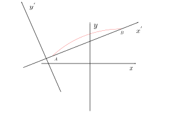
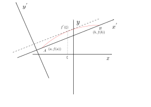
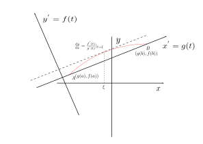
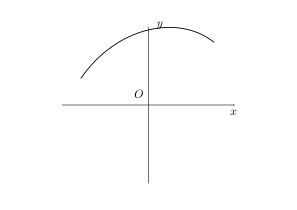
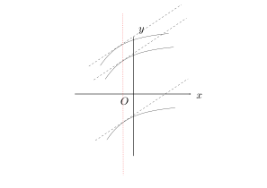

# Mean Value Theorem

## Rolle's theorem

* **theorem: on the closed section $[a,b]$, the function satisfy the conditions:

  1. $ f(x)\in C[a,b] $
  2. $f(x) \in D(a,b)$
  3. $f(a),f(b)$

  here is at least one point $\xi$ on the closed section  making $f^{'} (\xi)=0$
* proof:

  $$
  \text{according to the condition: }f(x)\in C[a,b]\\
      \Rightarrow \exists max(f(x))=M,min(f(x))=m\\
      m\leq M\\
      1. m=M\\
      \forall x\ in[a,b],m\leq f(x) \leq M=m\\
      \Rightarrow f(x)=m,x\in [a,b] \Rightarrow f(x) =m,x\in[a,b] \text{constant}\\
      \Rightarrow f^{'}(x)=0,\forall \xi,f^{'}(\xi)=0\\
      2.x<M,f(a)=f(b)  \\
      \text{amy as well consume the minimum value is on the open section }\exists \xi\in [a,b]\Rightarrow f(\xi )=m\\
      \Rightarrow f^{'}(\xi) \exists,\text{according to Fermat theorem :}\Rightarrow f^{'}(\xi )=0
  $$
* geometrical significance:
  a curve is continuous on the section $[a,b]$ , the tangent line exists everywhere ,which are not parallel with the axis $y$ ,and the value of the curve's endpoints are equal, so there must be a point on the curve,whos  tangent line is parallel with the axis $x$

## Langrage Theorem

* introduction : remove the condition

  > $f(a)=f(b)$ in the Rolle's theorem
  >

  
  the  curve is continuous and it's endpoints are the same value in the new coordinate system.
  
  it satisfy Rolle's theorem in the new coordinate system.

  $$
  f^{'}(\xi)=\frac{f(b)-f(a)}{b-a}
  $$
* **theorem**: if $f(x)$ defined on a closed section $[a,b]$ , the function satisfies these conditions:

  1. $ f(x)\in C[a,b] $
  2. $ f(x) \in D(a,b) $

  so there is at least one point $\xi,\xi\in (a,b)$having the characters :

  1. $ f^{'}\frac{f(b)-f(a)}{b-a} $
* **proof**: if we want to make the condition :$\exists \xi \in (a,b),\Rightarrow \frac{f(b)-f(a)}{b-a}$ established:

  $$
  \text{we should proof :} f^{'}(\xi)-\frac{f(b)-f(a)}{b-a}=0 \Rightarrow [f^{'}(x)-\frac{f(b)-f(a)}{b-a} |_{x=\xi}=0\\
      \Rightarrow \overset{F(x)=}{[f(x)-\frac{f(b)-f(a)}{b-a}(x-a)]^{'}|_{x=\xi}}=0 \\
      \text{this  function is a instruction function ,we need make it satisfied the Rolle's theorem 's conditions : }\\
      F(a)=f(a),F(b)=f(a)=F(a)\\
      \text{for simplizing the calculation: } \overset{F(x)=}{[f(x)-\frac{f(b)-f(a)}{b-a}(x-a)-f(a)]^{'}|_{x=\xi}}=0\\
      \Rightarrow F(a)=0,F(b)=0\\
      \Rightarrow F(x)=[f(x)-\frac{f(b)-f(a)}{b-a}(x-a)-f(a)],F^{'}(\xi)=0,\xi\in (a,b)
      \text{Proof:}\\
      F(x)\in C[a,b],F(x)\in D(a,b),F(a)=0,F(b)=0\\
      \text{according to Rolle's theorem: } \Rightarrow \exists \xi \in (a,b),\Rightarrow F^{'}(\xi)=0\Leftrightarrow \text{the cuduction is established }i
  $$
* **geometry**: when a curve descripted by the function ,the function satisfies the largrange condions , at least  apoint of the curve's tangent line is paralleling with the combination line of the both endpoints.

## Cauchy's theorem

* $\left\{\begin{array}{l}x=g(t)\\y=f(t)\end{array}\right.,a\leq t \leq b$,the parameter function defines a function $y=y(x)$, if the function satisfies the conditions:

  > 1. $ y=y(x) \in C[a,b] $  2. $y=y(x) \in D(a,b) $
  >

  

  $$
  k_{ab}=\frac{f(b)-f(a)}{g(b)-f(a)}=\frac{f^{'}(\xi) }{g^{'}(\xi) }
  $$

  so the condition will be :

  1. $f (t),g(t)\in C[a,b],\in D(a,b)$,$g^{'}(t)\neq 0 $
* **theorem**: is the function:

  * $f(x),g(x) \in C[a,b]$
  * $f(x),g(x) \in D(a,b)$
  * $g^{'}(x) \neq 0 $
    $\Rightarrow \exists \xi \in(a,b)\Rightarrow \frac{f(b)-f(a)}{b-a}=\frac{f^{'}(\xi) }{g^{'}(x) }$
* **proof**:

  $$
  \text{make: } F(x)=f(x)\frac{f(b)-f(a)}{g(b)-g(a)}(g(x)-g(a))-f(a)\\
      F(x)\in C[a,b],\in D (a,b)\\
      F(a)=F(b)=0\\
      \exists \xi \in (a,b),\Rightarrow F^{'}(\xi)=0\\
      F^{'}(x)=f^{'}(x)-\frac{f(b)-f(a)}{g(b)-g(a)}g^{'}(x) \\
      \Rightarrow f^{'}(\xi)-\frac{f(b)-f(a)}{b-a}g^{'}(\xi)=0,g^{'}(\xi)\neq 0\\
      \frac{f(b)-f(a)}{g(b)-g(a)}=\frac{f^{'}(\xi  ) }{g^{'}( x) }
  $$

# undecided type limitation

* introduction: $\lim_{x\Rightarrow x_0}\frac{f(x)}{g(x)}(\frac{0}{0})(0\infty)$,this kind is a type of "$\frac{0}{0}$" limitation.

  * example : $\lim_{x\rightarrow 0 }\frac{x-\sin x}{x^{3} }(\frac{0}{0})$
  * $\lim_{x\rightarrow x_0}\frac{f(x)}{g(x)}$,$\lim_{x\rightarrow x_0}f(x)=0,\lim_{x\rightarrow x_0}g(x)=0$
  * set $F(x)=\left\{\begin{array}{ll}f(x)&x\neq x_0\\0&x=x_0\end{array}\right .$,$G(x)=\left\{\begin{array}{ll}g(x)&x\neq x_0\\0&x=x_0\end{array}\right .$

  $$
  \lim_{x\rightarrow x_0}\frac{f(x)}{g(x)}=\lim_{x\rightarrow x_0}\frac{F(x)-F(x_0)}{G(x)-G(x_0)}
  $$

  so the $F(x),G(x),x\in [x_0,x],(x_0<x)$ or $[x,x_0],x<x_0$ ,$F(x) ,G(x)$ are continuous and derivable on the open section :**$ F(x),G(x) $ are derivable on the section $\overset{\circ}{U}(x_0,\delta)$,and $G^{'} (x)\neq=0$**

  * $ \exists \delta ,x\in \overset{\circ}{U}(x_0,\delta),f^{'}(x),g^{'}(x)\exists ,g^{'}(x)\neq 0   $
  * if $ \lim_{x\rightarrow x_0} \frac{f^{'}(x) }{g^{'}(x) }=A(\infty)$
  * 

  $$
  \lim_{x\rightarrow x_0}\frac{F^{'}(\xi) }{G^{'}(\xi) }(x_0<\xi<x,x_0<x,\xi \neq x_0)\\
    =\lim_{x\rightarrow x_0}\frac{f^{'}(\xi) }{g^{'}(\xi) }=\lim_{\color{red}{\xi \rightarrow x_0} }\frac{f^{'}(\xi) }{g^{'}(\xi) }\\
    =\lim_{x\rightarrow x_0}\frac{f^{'}(x) }{g^{'}(x) }=A(\infty)\text{\color {red}   Heine's Theorem}
  $$
* **these are the undecided type limitation existence's *sufficient conditions***:

  1. $F(x),G(x),x\in [x_0,x],(x_0<x)$ or $[x,x_0],x<x_0$ ,$F(x) ,G(x)$ are continuous and derivable on the open section :**$ F(x),G(x) $ are derivable on the section $\overset{\circ}{U}(x_0,\delta)$,and $G^{'} (x)\neq=0$**
  2. $ \exists \delta ,x\in \overset{\circ}{U}(x_0,\delta),f^{'}(x),g^{'}(x)\exists ,g^{'}(x)\neq 0   $
  3. if $ \lim_{x\rightarrow x_0} \frac{f^{'}(x) }{g^{'}(x) }=A(\infty)$

## L'Hospital's Rule $Ⅰ(\frac{0}{0})$

* Rule $Ⅰ$ : $\lim_{x\rightarrow x_0}f(x)=0,\lim_{x\rightarrow x_0}g(x)=0$
* Rule $ⅠⅠ$ : $\exists \delta >0,x\in \overset{\circ }{U}(x_0,\delta),\exists f^{'}(x),g^{'}(x),g^{'}(x)\neq 0   $
* Rule $ⅠⅠⅠ$ : $ \lim_{x\rightarrow x_0}\frac{f^{'}(x) }{g^{'}(x) }=A(\infty) $

  $$
  \Rightarrow \lim_{x\rightarrow x_0}\frac{f(x)}{g(x)}=\lim_{x\rightarrow x_0}\frac{f^{'}(x) }{g^{'}(x) }=A(\infty)
  $$
* **practicl method**: we can consume the conditions are satisfied , after calculation we see whether the limitation can use L'Hospital Rule.
* **expension** : $x_0$ is a constant , expend the condition range $ x\rightarrow x_0 $ to $ x \rightarrow x_0^{-}  ,x\rightarrow x_{0}^{+},x\rightarrow \infty ,x\rightarrow +\infty ,x\rightarrow -\infty $ , these limitations with all above kinds range can use L'Hospital's Rule.
* we use variable substition to get the original type

## L' Hospital Rule $ⅠⅠ(\frac{\infty}{\infty})$

* $\lim_{x\rightarrow x_0}f(x)=\infty,\lim_{x\rightarrow x_0}g(x)=\infty$
* $\exists \delta >0,x\in\overset{ \circ }{U}(x_0,\delta),f^{'}(x),g^{'}(x)\exists ,g^{'}(x)\neq 0   $
* $ \lim_{x\rightarrow x_0}\frac{f^{'}(x) }{g^{'}(x) }=A(\infty) $
  $$
  \lim_{x\rightarrow x_0}\frac{f(x)}{g(x)}=\lim_{x\rightarrow x_0}\frac{f^{'} (x)}{g^{'} (x)}=A(\infty)
  $$
* **expension** : $x_0$ is a constant , expend the condition range $ x\rightarrow x_0 $ to $ x \rightarrow x_0^{-}  ,x\rightarrow x_{0}^{+},x\rightarrow \infty ,x\rightarrow +\infty ,x\rightarrow -\infty $ , these limitations with all above kinds range can use L'Hospital's Rule.
* we use variable substition to get the original type

1. example:
   $$
   lim_{x\rightarrow 0}\frac{x-\sin x}{x^{3} }\overset{(\frac{0}{0})}{=}\lim_{x\rightarrow 0}\frac{1-\cos x}{3x^{2} }=\lim_{x\rightarrow 0 }\frac{-\sin x}{6x}=\lim_{x\rightarrow 0}\frac{\cos x}{6}=\frac{1}{6}
   $$
2. $ \lim_{x\rightarrow \infty} \frac{x^{50} }{e^{x} }=0$
3. $\lim_{x\rightarrow 0}\frac{\sin x-x\cos x}{(e^{x}-1 )(\sqrt[3]{1+x^{2} }-1)}$
   $$
   =\lim_{x\rightarrow 0}\frac{\sin x-x\cos x}{x(\sqrt[3]{1+x^{2} }-1)}\overset{(\frac{0}{0})}{=}\lim \frac{\sin x-x\cos x}{x\frac{1}{3}x^{2} }\overset{(\frac{0}{0})}{=}\lim \frac{\cos x+x\sin x-\cos x}{x^{2} }=\lim \frac{x\sin x}{x\frac{1}{3}x^{2}}=\\
     \lim \frac{\sin x+x\cos x}{2x} -\lim \frac{-\cos x+\cos x -x\sin x}{2}=1?????
   $$
4. $\lim_{x\rightarrow 0^{+}}x^{a} \ln x(a>0),(0\times \infty)$
   $$
   =\lim \frac{\ln x}{x^{-a} }\overset{(\frac{\infty}{\infty})}{=}\lim \frac{\frac{1}{x}}{-ax^{-a-1} }=-\frac{1}{a}x^{a}=0
   $$
5. $\lim_{x\rightarrow 0}(\frac{1}{x}-\frac{1}{e^{x} -1})(\infty-\infty)$
   $$
   \lim \frac{e^{x} -1-x}{x(e^{x} -1)}=\lim \frac{e^{x}-1-x }{x^{2} }\overset{(\frac{0}{0})}{=}\lim \frac{e^{x}-1 }{2x}=\frac{1}{2}
   $$
6. $ \lim _{x\rightarrow \infty} (x-x^{2}\ln (1+\frac{1}{x}) ),(\infty-\infty)$
   $$
   \overset{\frac{1}{x}=t}{=}\lim [\frac{1}{t^{2} }-\frac{\ln(1+t)}{t^{2} }]=\lim_{t\rightarrow 0}\frac{t-\ln(1+t)}{t^{2} }=\overset{(\frac{0}{0})}{=}\lim \frac{1-\frac{1}{1+t}}{2t}=\lim \frac{t}{2t(1+t)}=\frac{1}{2}
   $$
7. $ \lim_{x\rightarrow x_0} u(x)^{v(x)} =a^{b} $
   1. $\lim_{x\rightarrow 0}(\frac{\sin x}{x})^{\frac{1}{x^{2} }} ,(1^{\infty} )$
      $$
      =\lim [1+(\sin x -1)]^{\frac{1}{\frac{\sin x}{x}-1}(\frac{\sin x}{x}   -1)\frac {1}{x^{2} }} =\\
        e^{\lim \frac{\sin x -x}{x^{3} }}=e^{-\frac{1}{6}}
      $$
8. $ \lim_{x\rightarrow x_0}f(x)^{g(x)} (1^{\infty} ,\infty^{0},0^{0}  ) $
   $$
   \Rightarrow \lim e^{g(x)\ln f(x)}= e^{\lim g(x)\ln f(x)} \overset{i\text{f the limitation exists}}{=}e^{\lim \frac{\ln f(x)}{\frac{1}{g(x)}}}(\text{\color{red} it must be a undecided type limitation})
   $$

# Series' undecided type limitation

* introduction : $ \lim_{n\rightarrow \infty} f(x)$(undecided type limitation): if $\lim_{x\rightarrow \infty }f(x)$ is also a undecided type limitation and the limitation $\lim_{x\rightarrow \infty}f(x)=A(\infty)$, the limitation $\lim_{n\rightarrow \infty}f(n)=A(\infty)$(**Heini's theorem**). But if the limitation $\lim_{x\rightarrow \infty }f(x)$ unexists ,we cannot say the limitation $\lim_{n\rightarrow \infty}f(n)$ unexists , we should use another methods.
* example: $ \lim_{n\rightarrow \infty} [(1+\frac{1}{n})^{n}-e ]n(0\times \infty)$
  $$
    =\lim_{x\rightarrow \infty }[(1+\frac{1}{x})^{x}-e ]x\overset{\frac{1}{x}=t}{=}\lim_{t\rightarrow o^{+} }\frac{(1+t)^{\frac{1}{t}} -e}{t}=\lim_{t\rightarrow 0^{+} }\frac{e^{\frac{\ln(1+t)}{t}-e} }{t}\\
    =\lim_{t\rightarrow 0^{+} }e^{\frac{\ln(1+t)}{t}}\frac{\frac{1}{1+t}-\ln(1+t)}{t^{2} }=\lim_{t\rightarrow 0^{+} }\frac{t-(1+t)\ln(1+t)}{t^{2} }(\frac{0}{0})\\
    \overset{L'Hospital}{=}\lim_{t\rightarrow 0^{+} }\frac{-\ln(1+t)}{2t} =\frac{-e}{2}
  $$  

# the applications of mean value theorem 

## the applications of Rolle's theorem

### proof the  existence of roots of a equation

* proof $f(x)=0$ has a root on the section of $(a,b)$
  $$
    \text{if } \exists F(x) ,\forall x\in[a,b],F^{'}(x)=f(x)\Leftrightarrow \\
    F^{'}(\xi)=0\\
    \text{applicate Rolle's theorem for }F(x)\\
    \Rightarrow \exists \xi \in(a,b),F^{'}(\xi)=0\Leftrightarrow f(\xi)=0    
  $$ 

  * example: $a_1,a_2,\dots,a_n$ are all real numbers,proof $a_1\cos x+a_2\cos x+\dots +a_n\cos nx=0$, have a root on the section $(0,\pi)$
    $$
    f(x)=a_1\cos x+a_2\cos 2x+...+a_n\cos n x ,f(x)\in C[0,\pi]\\
    \text{structure }((\sin nx)^{'} =n\cos nx\Rightarrow \frac{1}{n}(\sin nx )^{'}=\cos nx ) \Rightarrow (\frac{1}{n}\sin nx )^{'}=\cos nx \\
    F(x)=a_1\sin x+a_2\frac{\sin 2x}{2}+...+a_n\frac{\sin nx }{n}\\
    F^{'}(x)=f(x),x\in [0,\pi],F(x)\in C[0,\pi]  ,\in D(0,\pi)\\
    F(0)=F(\pi)=0\\
    \text{ according to Rolle's theorem :} \exists \xi \in (0,\pi),\Rightarrow F^{'} (\xi)=0 ,\Rightarrow f(\xi )=0,\Rightarrow\\
    \text{the quation has a root on the section}
    $$  

* proof:a formula with a $\xi$ (especially has a derivative with $\xi$) $\Leftrightarrow f^{'}(\xi)=0 $
  * example: the proof of largrange's theorem and cauchy's theorem

## the applications of Largrange's Theorem

* $ \exists \xi \in (a,b) \frac{f(b)-f(a)}{b-a}=f^{'}(\xi) \Leftrightarrow f(b)-f(a)=f^{'}(\xi)(b-a)   $
* when $ b<a $ ,and the $f(x)$ satisfies the largrange's conditions on the $[b,a]$ ,the $f(b)-f(a)=f^{'}(\xi)(b-a) $ still established.
* whatever $a>b,a<b$ ,$0<|\frac{\xi-a}{b-a}|<1\Rightarrow 0<\frac{\xi-a}{b-a}<1$,set $\theta =\frac{\xi-a}{b-a},0<\theta <1$,$\xi =a+\theta (b-a)$
  $$
    \Rightarrow f(b)-f(a)=f^{'}(a+\theta (b-a))(b-a)(0<\theta<1) \\
    \Leftrightarrow     f(x_2)-f(x_1)=f^{'}(x_1+\theta (x_2-x_1))(x_2-x_1),(x1,x_2\in (a,b),x_1\neq x_2) \\
    \Leftrightarrow f(x_0+\Delta x)-f(x_0)=f^{'}(x_0+\theta \Delta x)\Delta x ,(\Delta x\neq 0) 
  $$ 
  * monotonic theorem's proof:
    $$
      f(x)\in C I,I\text{ is forall}\\
      f(x) \in D I\\
      x\in I ,f^{'}(x)\geq 0(>0),f(x) \text{ increases on } I \text{(strictly increases)},x\in I ,f^{'}(x)\leq 0(f^{'}(x)<0 ...),f^{'}(x)=0,f(x)=C  
    $$ 
    proof:
    $$
      \forall x_1,x_2 \in I,x_1<x_2\\
      \exists \xi (x-1,x_2),f(x_2)-f(x_1)\overset{largrange's theorem }{=}f(\xi)(x_2-x_2)\\
      f^{'}(\xi) \geq 0\Rightarrow f(x_2)-f(x_1)\geq 0\Rightarrow f(x_1)\leq f(x_2)\\
      \text{for the same step ,we can proof all the situation}
    $$ 
  
  * proof inequations 
    $$
      b>a\geq e,a^{b} >b^{a} ?\\
      a^{b}>b^{a}\Leftrightarrow \ln a^{b} >\ln  b^{a}\Leftrightarrow     b\ln a>a\ln b \Leftrightarrow \frac{\ln a}{a}> \frac{\ln b}{b}(a,b \neq 0)\\
      f(x)=\frac{\ln x}{x},x\in [a,b],f(x)\in C[a,b],\in D(a,b)\\
      f(b)-f(a)=f^{'}(x)(b-a),f^{'}(x)=\frac{1-\ln x }{x^{2} }<0\\
      f(b)<f(a)  
    $$ 
  * example:
    $$
      0<x<\frac{\pi }{2 },\tan x>x+\frac{x^{3} }{3}?\\
      f(x)=\tan x-x-\frac{x^{3} }{3},x\in [0,\frac{\pi }{2}],\\
      f(x) \in C[0,\frac{\pi}{2}),\in D(0,\frac{\pi}{2})\\
      f(0)=0,f^{'}(x)=sec^{2}x -x-x^{2}=\tan ^{2}x-x^{2}  >0 ,f(x)-0=f^{'}    (x-0)>0\\
      f(x)>0
    $$ 

## justice the extremium

* from the extreme point must included in the arrest points or underivable point s on the section.

1. the first sufficient condition: $f(x) \in CU(x_0,\delta),\in D\overset{\circ}{U}(x_0,\delta)$(emphasize the function is continuous on the point $x_0$)
    1. when $x\in (x_0-\delta ,x_0),f^{''}(x)>0,x\in (x_0,x_0+\delta),f^{'}(x)<0,\Rightarrow f(x_0) \text{is a maximum}$
    2. when $x\in (x_0-\delta ,x_0),f^{''}(x)<0,x\in (x_0,x_0+\delta),f^{'}(x)>0,\Rightarrow f(x_0) \text{is a minimum}$
    3.  if the $f^{'}(x)$ of $x_0$'s both sides is the same sigal , the $x_0$ is not the extreme point.
2. the second sufficient condition: if $f^{'}(x_0)=0$,and $f^{''}(x)$ exits 
    1. $f^{''}(x_0)>0,f(x_0)$ is the minimum.
    2. $f^{''}(x_0)<0,f(x_0)$ is the maximum.
    3. $f^{''}(x_0)=0$ we cannot use this method.
    * proof : 
        1. when $f^{''}(x_0)>0,f^{''}(x_0)=\lim_{x\rightarrow x_0}\frac{f^{'}(x)-f^{'}(x_0)}{x-x_0}=\lim_{x\rightarrow x_0}\frac{f^{'}(x_0)}{x-x_0}=f^{''}(x_0)$(if $f^{''}(x_0)$ exits,the $f^{'}(x_0)\exists$ on the section $U(x_0)$,and the function is continuous),(but if $f(x)$ is derivable on the point $x_0$,we cannot get the conclusion that the function is derivable on the section $U(x_0)$)
        2. inverse example: $f(x)=\left\{\begin{array}{ll}x^{2}&x\text{ is retional number }\\-x^{2}&x\text{ is irretional number}\end{array}\right.$
           $$
           \lim_{x\rightarrow 0}\frac{f(x)-0}{x-0}=\lim_{x\rightarrow 0}\frac{x^2}{x}=0(\text{from the path of the retional numbers})\\
           \lim_{x\rightarrow 0} -\frac{x^2}{x}=0\\
           f^{'}(0)=0\\
           \text{when} x\neq x_0\\
           \lim_{x \rightarrow x_0}=\left\{\begin{array}{l}\lim_{x\rightarrow x_0}x^2\\\lim_{x\rightarrow x_0}-x^2\end{array}\right.\\
           \text{the derivate is inexists }
           $$
        3. $\exists \delta >0,x\in \overset{\circ }{U}(x_0,\delta),\frac{f^{'}(x_0)}{x-x_0}$:
           $$
           x\in(x_0-\delta ),f^{'}(x)<0\\
           x\in (x_0+\delta),f^{'}(x)>0\\
           \Rightarrow \text{the point is a minimum}\\
           \text{for the same step,the second situation is for the same reason}\\
           \text{the third conditions:example:}\\
           f(x)=x^3,f^{'}(x)=3x^{2},f^{''}(x)=6x,f^{'}(0)=0,f^{''}(0)=0,f(0)\text{ is not a extreme point }
           $$
           
3. get the monotonic section of a functionn
   1. get the function's definition section
   2. get the inner section's stationary points or underivatiable points.
   3. list the every sections.
   4. get every sections' monotonic character
   * example :
    $$
      f(x)\frac{2}{3}x-\sqrt[3]{x^{2} }\\
      \text{definition section is} \mathcal{R}\\
      f^{'}(x)\frac{2}{3}-\frac{2}{3}x^{\frac{-1}{3}} \\
      f^{'}(x)=0\Rightarrow   x=1\\
      \nexists f^{'} (0)\\
    $$       

    |    $x$     | $(-\infty ,0)$ |  $0$  | $(0,1)$  | $(1,+\infty)$ |
    | :--------: | :------------: | :---: | :------: | :-----------: |
    | $f^{'}(x)$ |       +        |   0   |    -     |       +       |
    |   $f(x)$   |    increase    |   0   | decrease |   increase    |

# Mathematical Models and the introduction of Taylor's Formula

* mathematical optmization
* how to calculate a funtion's approximate value

# Taylor's  Formula

* introduction: $f(x)=e^{x},f(3.15) $?
* from the largrange theorem : if the function on the section $[a,b]$ satisfies the Largrange's conditions ,the $f(b)-f(a)=f^{'}(x\xi)(b-a)\Rightarrow f(b)=f(a)+f^{'}(\xi)(b-a) ,b=x,a=x_0,x\neq x_0,\Rightarrow f(x)=f(x_0)+f^{'} (\xi)(x-x_0)$
  $$
    f(x)=f(x_0)+f^{'}(\xi)(x-x_0) 
  $$ 
  $f(x)$ use the $f(x_0)$ be the approximation ,the error is $f^{'}(x_0)(x-x_0) $
  if the function has the second order derivative :
  $$
    f^{''}(x) \exists\\
    \text{consume the approximation :}f(x)=f(x_0)+f^{'}(x-x_0)+k(x-x_0)^{2}   \\
    f(x)-[f(x_0)+f^{'}(x-x_0) ]=k(x-x_0)^{2}\\
    k=\frac{f(x)-[f(x_0)+f^{'}(x-x_0)   ]}{(x-x_0)^{2} }
  $$ 
  the problem is what is the error $k$?
* proof of $K$:
  $$
    F(x)=f(x)-[f(x_0)+f^{'}(x_0)(x-x_0) ]\\
    G(x)=(x-x_0)^{2}\\
    F^{'}(x) = f^{'}(x)+f^{'}(x_0),F^{''}(x)=f^{''}(x)   \\
    F(x_0)=0,F^{'} (x_0)=0\\
    G(x)=2(x-x_0)  ,G^{''}(x)= 2!,G(x_0)=0,G^{''} (x_0)=0\\
    k=\frac{F(x)-F(x_0)}{G(x)-G(x_0)}\overset{\text{Cauchy's theorem}}{=}=\frac{F^{'} (\xi_1)}{G^{'}(\xi_1) }(\text{may as well }x_0<x,x_0<\xi_1<x)=\frac{F^{'}(\xi_1)-F^{'}(x_0)  }{G^{'}(\xi_1)-G^{'}(x_0)  }=\frac{F^{''}(\xi_2 ) }{G^{''}(\xi_2) }=\frac{f^{''}(\xi ) }{2!} \\
    f(x)=f(x_0)+f^{' }(x_0) (x-x_0)+\frac{f^{''}(\xi) }{2!}(x-x_0)^{2} 
  $$ 
  we guess if the third order derivative exists ,$f(x)=f(x_0)+f^{'}(x-x_0)+\frac{f^{''} (x_0)}{2!}(x-x_0)^{2}+\frac{f^{'''}(\xi) }{3!}(x-x_0 ) ^{3}  $

* **Taylor 's Formula**:if $f^{n}(x)\in CI$,$\exists f^{(n+1)}(x) ,x\in I$ ,$x_0\in I,\forall x\in I,x\neq x_0$:
  $$
    f(x)=f(x_0)+f^{'}(x_0)(x-x_0) +\frac{f^{''}(x_0)}{2!}(x-x_0)^{2} +\dots +\frac{f^{(n)}}{n!}  (x_0)(x-x_0)^{n} + \frac{f^{(n+1)} }{(n+1)!}(\xi)(x-x_0)^{n+1} ,\xi\in(x_0,x)
  $$ 
  this is called  $f(x)$ 's Taylor formula on the point $x$
  $$
    f(x_0)+f^{'}(x_0) (x-x_0)+\frac{f^{''}(x_0) }{2!}(x-x_0)+\dots \frac{f^{(n)} (x_0)}{n!}(x-x_0)^{n}\overset{\Delta }{=}P_n (x)
  $$ 
  this is called nth order Taylor series 
  $$
    \frac{f^{(n+1)(\xi)} }{(n+1)!}(x-x_0)^{n+1}\overset{\Delta}{=}R_{n}(x) 
  $$ 
  this is called the Taylor's *largrange remainder*.

* Other form of the formula : $\xi \in (x_0,x),0<\theta<1$:
  $$
    R_{n}(x)=\frac{f^{(n+1)}(x_0+\theta(x-x_0)  )}{(n+1)!}(x-x_0)^{n+1}  
  $$ 
  thiis is called Cauchy's remainder.
  if :
  $$
    f(x)\approx p_n(x),error(x)=|f(x)-P_n(x)|=|R_n(x)|=|\frac{f^{(n+1)}(x_0+\theta(x-x_0))}{(n+1)!}(x-x_0) ^{n+1} |=|\frac{f^{(n+1)(\xi)} (\xi)}{(n+1)!}||x-x_0|^{n+1}\\
    \text{if }|f^{(n)} (x)|\leq M,n=0,1,2\dots\leq M\frac{|x-x_0|^{n+1} }{(n+1)!} \\
    \text{because we konw the}x,x_0\\
    \Rightarrow \lim_{n\rightarrow \infty} R_{n}(x)\geq\lim_{x\rightarrow \infty}\frac{a^{n} }{n!}=0\\
    R_{n}(x)\leq\lim{n\rightarrow \infty}\frac{a^{n+1} }{(n+1)!}=0
  $$

* especially : $0\in I,x_0=0$:
  $$
    f(x)=f(0)+f^{'}(0)x+\frac{f^{''}(x) }{2!} x^{2}+\dots+\frac{f^{(n)} (x)}{n!}x^{n}+\frac{f^{(n+1)} (\xi)  }{(n+1)!}x^{n+1}  
  $$ 
  this is called $f(x)$ on the point $x=x_0$ 's **Maclaurin's Formula**
  $$
    R_n(x)=\frac{f^{(n+1)}(\xi) }{(n+1)!}x^{n+1} 
  $$ 
  this is the **Maclaurin 's remainder**

## Some basic functions' Maclaurin's expansion

* $e^{x}$:
  $$
    \forall x\in R, f^{(n+1)} (x)\exists\\
    f^{(n)} (x)=e^{x},n=0,1,2,\dots \\
    e^{x}=1+ x + \frac{1}{2!}x^{2} +\dots +\frac{1}{n!}x^{n} +\frac{e^{\xi} }{(n+1)!} x^{n+1},\xi\in (a,x) ,x\in (-\infty,\infty)
  $$ 

* $f(x)=\sin x$
  $$
    \forall x\in R,f^{(n+1)}(x)\exists\\
    f^{(n)} (x)=sin(x+n\frac{\pi}{2}) \\
    f^{(n)} (0)=\sin \frac{n\pi}{2},n=0,1,2,\dots,n=2k,f^{(k)}(0)=0,n=2k+1,f^{(k)}(0)=(-1)^{k}   ,=0,1,2,\dots\\
    \text{2n terms is all }0,n=2m+1\\
    \sin x= 0- \frac  {1 }{3!}x^{3}+\frac{1}{5!}x^{5} -\frac{1}{7!}x^{7} \dots+\frac{(-1)^{m} }{(2m+1)!}x^{2m+1}  + R_+{2k+1}(x)\\
    R_{k+1}=\frac{f^{(2k+1)}(\xi) }{(2k+2)!}x^{2k+1}=\frac{\sin[\xi+(2k+2)\frac{\pi }{2}]}{(2k+2)!}x^{2k+2},\xi \in (0,x),x\in (-\infty,\infty)  
  $$ 
  ****
  **we can first get the $n$ order terms ,and use the n order term to get the every terms**
  ****
  or:
  $$
    \sin x=x-\frac{x^{3} }{3!}+\frac{x^{5} }{5!}-\frac{x^{7} }{7!}+\dots+\frac{(-1)^{k} }{(2k+1)!}x^{2k+1}+0\times x^{2k+2}+R_{2k+2}(x)  
  $$ 

* $\cos x$:
  $$
    \cos x=1-\frac{x^{2} }{2!}+ \frac{x^{4} }{4!}-\frac{x^{6} }{6!}+\dots +\frac{(-1)^{k} }{(2k)!}+R_{2k}(x),x\in (-\infty,\infty)
  $$  

* $f(x)=\ln(1+x)$
  $$
    1+x>0,x>-1,f^{(n+1)} (x)\exists,f^{(n)}(-1)^{n-1}(1+x)^{-n}\\
    f^{(n)} (0)=(-1)^{n-1}(n-1)!,n=1,2,3,\dots\\
    \ln(1+x)=x-\frac{x^{2} }{2}+\frac{x^{3} }{3}-\frac{x^{4} }{4}+\dots+\frac{(-1)^{(n-1)} }{n}x^{n} +R_n(x),x\in(-1,\infty)
  $$ 

* $(1+x)^{a}$
  $$
    x\in(-1,\infty),f^{(n)}(x)= a(a-1)(a-n+1)(1+a)^{a-n} ,n=0,1,2,\dots\\
    f^{(n)} =a(a-1)\dots(a-n+1)\\
    (1+x)^{a}=1+1+ax+\frac{a(a-1)}{2!}x^{2}+\dots+\frac{a(a-1)\dots(a-n+1)}{n!}x^{n}+R_{n}(x),x\in(-1,\infty)
  $$ 

## the applications of Taylor's Formula

* in the approximating calculation:
  1. proof the $e$ is a irrational number and approximate its value.
* proof the inequations:
  * example:
    $$
      f^{''}(x)>0,\lim_{x\rightarrow 0}\frac{f(x)}{x}=1,\Rightarrow f(x)\geq x?\\
      f^{''}(x)\exists \Rightarrow f(x),f^{'}(x)\exists \\
      \lim_{x\rightarrow 0}\frac{f(x)}{x},1\Rightarrow \lim_{x\rightarrow 0}x=0,\Rightarrow \lim_{x\rightarrow 0}f(x)=0=f(0)\\
      \lim_{x\rightarrow 0}\frac{f(x)}{x}=\lim_{x\rightarrow 0}\frac{f(x)-0}{x-0}=1\Rightarrow f^{'}(x)=0\\
      f(x)=f(0)+f^{'}(0)x +\frac{f^{''}(\xi ) }{2!}x^{2}=x+\frac{f^{''} (\xi)}{2!} x^{2}\geq x
    $$  
  
* **A Theorem**: if $\lim_{x\rightarrow 0}\frac{f(x)}{g(x)}=C$,$C$ is a constant,$\lim_{x\rightarrow 0}g(x)=0\Rightarrow \lim_{x\rightarrow 0}f(x)=0$

* proof a formula with $\xi$,(especially the formula has a derivative with $\xi$)
  *  example: $f(x) \in D^{(n)} [a,b],f(a)=0,f^{(k)}(b)=0,k=0,1,2,3,\dots,n-1,\xi \in (a,b)\Rightarrow f^{(n)}(\xi)=0$?:
     $$
       f(x)=f(b)+f^{'}(b)(x-b)+\frac{f^{(2)}(b) }{2!}(x-b)^{2}+\dots +\frac{f^{(n-1)}(b) }{(n-1)!}(x-b)^{n-1}+\frac{f^{(n)} }{n!}(x-b)^{n}=\frac{f^{n}(\xi) }{n!}(x-b)^{n},x<\xi<b\\
       0=f(a)=\frac{f^{(n)} }{n!}(a-b)^{n}\\
       \Rightarrow f^{n}(\xi)=0        
     $$   

## The Taylor's Formula with Piano-remainder term

* remainder of Taylor's formula : $R_n(x)=\frac{f^{(n+1)} (\xi)}{(n+1)!}(x-x_0)^{n+1}$,from $\lim_{x\rightarrow x_0}\frac{R_{n}(x)}{(x-x_0)^{n} }=\lim_{x\rightarrow x_0}\frac{f^{(n+1)}(\xi) }{(n+1)!}(x-x_0)$:
  $$
    \text{if } |f^{n}(x) |\leq M,n=0,1,2,\dots\\
    \text{so :} \lim_{x\rightarrow x_0}\frac{f^{(n+1)}(\xi) }{(n+1)!}(x-x_0)=M\times (\text{infinitesimal})=0\\
    \Rightarrow R_{n}(x)=o([(x-x_0)]^{n} )(x\rightarrow x_0)
  $$  

* Piano's Theorem: if $f(x)$ 's nth order derivative exists on the $x_0$:
  $$
    f(x)=f(x_0)+f^{'}(x_0)(x-x_0)+\frac{f^{(2)} (x_0)}{2!} +\dots +\frac{f^{(n)}(x_0) }{n!}(x-x_0)^{n}+o([x-x_0]^{n} ) ,(x\rightarrow x_0)
  $$ 
  proof: *proof of Piano's theorem*
  especially $x_0=0$,the formula is Maclaurin's Fomula with a Piano-remainder term

* some useful Maclaurin's Formula:
  *  $e^{x}=1+ x + \frac{1}{2!}x^{2} +\dots +\frac{1}{n!}x^{n} +o(x^{n} ),\xi\in (a,x) ,x\in (-\infty,\infty)$ 
  *  $\sin x= 0- \frac  {1 }{3!}x^{3}+\frac{1}{5!}x^{5} -\frac{1}{7!}x^{7} \dots+\frac{(-1)^{m} }{(2m+1)!}x^{2m+1}  + 0(x^{n} )$
  * \dots (makes the $R_{n+1}(x)$ be $o(x^{n} )$)

## the applications of Piano's Theorem on limitation $(\frac{0}{0})$

* $f(x) =0+0x+\dots+0x^{k-1}+o(x^{k} )\sim Ax^{k},(x\rightarrow 0)$,$g(x)=Bx^{m}+o(x^{m} )\sim Bx^{m} ,(x\rightarrow 0),B\neq 0$
  $$
    \lim_{x\rightarrow 0}\frac{f(x)}{g(x)}=\lim_{x\rightarrow 0}\frac{Ax^{k} }{Bx^{m} }=\left\{\begin{array}{ll}0& k>M\\\frac{A}{B}& k=m\\\infty&k<m\end{array}\right.
  $$ 
* $\lim_{x\rightarrow x_0}\frac{f(x)}{g(x)},(\frac{0}{0})\overset{x-x_0=t}{=}\lim_{t\rightarrow 0}\frac{f(x_0+t)}{g(x_0+t)}(\frac{0}{0})$
* example:$\lim_{x\rightarrow 0}\frac{e^{-\frac{x^{2} }{2} } -\cos x}{x^{4} }$ :
  $$
    e^{x}=1+x+\frac{x^{2} }{2!}+\dots\\
    e^{-\frac{x^{2} }{2}}  =1-\frac{x^{2} }{x}+\frac{x^{4} }{8}+\dots \\
    \cos x=1-\frac{x^{2} }{2!}+\frac{x^{4} }{4!}+\dots\\
    \lim = \frac{1}{12}
  $$ 

## Use the Piano's Theorem getting the infinitesimal

* $x\rightarrow 0,f(x)$ is the ?th order of $(x-x_0)$'s infinitesimal:
  $$
    \lim_{x\rightarrow 0}\frac{f(x)}{(x-_0)^{k}}=C\neq 0(k>0)\\
    \Leftrightarrow f(x) \sim C(x-x_0)^{k}(x\rightarrow x_0) \\
    \text{function is the }x\rightarrow x_0,(x-x_0)\text{ 's kth order infinitesimal}
  $$ 
* example: $x-\sin x,x\rightarrow 0$ is the $x$'s ? th order infinitesimal :
  $$
    \sin x=x-\frac{1}{3!}x^{3} +\frac{1}{5!}x^{5}+\mathrm{o}(x^{6} )\\
    x-\sin x=-\frac{1}{3} x^{3}+\mathrm{o}(x^{3} )\\
    x-\sin x\sim \frac{1}{6}x^{3},({\color{red}x\rightarrow 0})  
  $$ 
  so the $x-\sin x$is the third order of $x$ infinitesimal.
  $$
    \lim_{\rightarrow 0}\frac{x-\sin x}{x^{k} }=C\neq 0\\
    \lim_{x\rightarrow 0}\frac{1-\cos x}{kx^{k-1} }=\lim_{x\rightarrow 0}\frac{\frac{1}{2}x^{2} }{kx^{k-1} }\overset{k-1=2,k=3}{=}\frac{1}{6}=C
  $$ 

# the curve's convexity and convacity and inflexion

* applications: draw the image of a function$f(x),x\in D$the image of the $f(x)$
* definition : if $f^{'} (x)$ is continuous , we define that the curve $y=f(x)$ is smooth **(first order smooth)**
  
  

  this is a convexity function , the other kind is convacity function
* i**Jensen's Inequality**:f every points of the curve's tangent line is beneath the function curve, the function curve is *convacity*, the other kind is convexity
  $$
    \forall x_1,x_2 \in I\\
    \frac{f(x_1)+f(x_2)}{2}>f(\frac{x1+x_2}{2})
  $$ 
  or the form:
  $$
    \Leftrightarrow\\
    x_1,x_2\in I\\
    x\in (x_1,x_2),x=\lambda x_1+(1-\lambda )x_2,0<\lambda<1\\
    \lambda f(x_1)+(1-\lambda)f(x_2)>f(\lambda x_1+(1-\lambda )x_2)
  $$ 

* **Theorem**: how to justice a curve's convexity and convacity? if $f(x)$ is second order derivable on the section $(a,b)$, $f^{''} (x)>0$,so the curve is convacity on the section, and if $f^{''}(x)<0$,the curve is convexity on the section.
* proof: 
  $$
    \forall x_0\in (a,b),(x_0,f(x_0))\text{ on the curve}\\
    \text{the tangent equation is: }y-f(x_0)=f^{'}(x_0) (x-x_0) ,y=f(x_0)+f^{'} (x _0)(x-x_0)\\
    \forall x\in (a,b),f^{''}(x)>0,\forall x\in (a,b) ,x\neq x_0\\
    f(x)=f(x_0)+f^{'}(_0)(x-x_0)+\frac{f^{''}(x_0) }{2!}(x-x_0) +R_{2}(x)\\
    f(x)>f^{'}(x_0)(x-x_0) \Leftrightarrow f^{''}(x_0) >0\\
    \text{the orther situation is in a simlar way}
  $$ 
* inflexion : if $f^{''}(x)=0,f^{'''}(x_0)\neq 0$,the $(x_0,f(x_0))$ will be the function's inflexion.
* proof:
  $$
    f^{'''}(x_0) \neq 0, \text{may as well } f^{'''}(0)>0\\
    \exists \delta >0,x\in \overset{\circ }{U}(x_0,\delta),\frac{f^{''}(x_0) }{x-x_0}>0\\
    x\in(\delta,x_0),x-x_0<0 \Rightarrow f^{''}(x)<0\\
    x\in (x_0,\delta ),x-x_0>0,\Rightarrow f^{''}(x)>0 
  $$ 
* steps:
  1.  get the function's definition section.
  2.  $f^{''}(x)=0$,the points where second order derivative inexists.
  3.  make the list 

## the function's image and asymptote

* the definition of a function's asymptote: if points on the curve $P(x,f(x))$,the distance between the line and the curve's limitation is $0$ in the prossess of $x\rightarrow \infty$,the line $L$ is a *asymptote*

_there is three classes loss_

# indefinite integral

actually,we want to know $F^{'}(x)=f(x)$,(f(x) is acknowledged),what is $F(x)$?
$$
  \Leftrightarrow f(x) \mathrm{d} x=F^{'}(x) \mathrm{d}x=\mathrm{d}F(x),F(x)? 
$$ 

* definition : $f(x)$ is defined on the section $I$,,if $\exists F(x),\forall x\in I,\Rightarrow F^{'} (x)=f(x)$, the $F(x)$ is the function $f(x)$'s *primitive functions*.the $F(x)$ is one of the function $f(x)$'s primitive functions,the  $F(x)+C$ is also a primitive function, $C$ is a constant number, $C\in \mathcal{R}$    
* proof the primitive function must be $F(x)+C$:
  $$
    \forall G(x) \text{is a any primitive function on the section } I\\
    \forall x \in I,G^{'}(x)=f(x)\\
    [G(x)-F(x)]^{'}=G^{'}(x)-F^{'}(x)=f(x)-f(x)=0\\
    \Rightarrow G(x)-F(x)=0,x\in I\\
    G(x)=F(x)+C    
  $$ 
* theorem: i f$F(x)$ is one of the primitive functions of $f(x),x\in I$, the $F(x)+C$ is the all of primitive functions of $f(x)$ on the definition section.**Set of all the primitive functions of $f(x)$ is called $f(x)$'s indefinite integrel on the section $I$**,the symbol is :
  $$
    \int f(x)\mathrm{d}x\\
    \int f(x) \mathrm{d}x =F(x)+C,x\in I,C \in \mathcal{R}
  $$
  > $C$!!!!!

| $f(x)$        | $f(x)\mathrm{d}x$        | $x$                         | $\int$                         |
| ------------- | ------------------------ | --------------------------- | ------------------------------ |
| **integrand** | **integrand expression** | **veriable of integration** | **indefinite integral symbol** |
## characters

1. $(\int f(x) \mathrm{d}x)^{'} =\frac{\mathrm{d}}{\mathrm{d}x}\int f(x) \mathrm{d}x=f(x)$
2. $\mathrm{d}\int f(x)\mathrm{d}x=f(x)\mathrm{d}x$  
3. $\int f^{'} (x)\mathrm{d}x=\int \frac{\mathrm{d}}{\mathrm{d}x}f(x)\mathrm{d}x=f(x)+C$ 
4. $\int \mathrm{d}f(x)=f(x)+C$
   $$
     \int g(0)\mathrm{d}x=\int \mathrm{d}G(x)=G(x)+C
   $$ 

## Geometrical  Significance

* consume $F(x)$ is the primitive function of $f(x)$,$F(x)=\int f(x) \mathrm{d}x$, $\Rightarrow (\int f(x)\mathrm{d}x)^{'} =(F(x)+C)^{'} =f(x)$ 

## Basic indedinite integral 

1. $\int 0 \mathrm{d}x=C$
2. $\int 1 \mathrm{d}x=\int \mathrm{d}x=x+C$
3. $\int x^{a} \mathrm{d}x=\frac{1}{a+1}x^{a+1}+C,(\neq -1)$:
   $$
     (x^{a+1} )^{'}=(a+1)x^{a}\\
     a\neq -1,\frac{1}{a+1}\\
     (\frac{1}{a+1}x^{a+1} )^{'}=x^{a}    
   $$
4. $\int x^{-1} \mathrm{d}x=\int \frac{1}{x}\mathrm{d}x=\ln|x|+C$:warning!:$\ln x+C$'s definition section   is different from $\frac{1}{x}$!!!!
5. $\int a^{x}\mathrm{d}x=\frac{a^{x} }{\ln a}+C$
6. $\int e^{x}\mathrm{d}x=e^{x}+C$
7. $\int \cos x\mathrm{d}x=\sin x+C$
8. $\int \sin x\mathrm{d}x=\cos x+C$
9. $\int \sec^{2}\mathrm{d}x=\tan x+C$
10. $\int \csc^{2}x \mathrm{d}x=-\cot x+C$
11. $\int \sec x\tan x \mathrm{d}x =\sec x+C$
12. $\int \csc x\cot x\mathrm{d}x=-\csc x+C$ 
13. $\int \frac{1}{1+x^{2} }$
14. $\frac{1}{1+x^{2} }=\arctan x+C=-\arcctg x+C_1$
15. $\int \frac{1}{\sqrt{1-x^{2} }}=\arcsin x+C=-\arccos x+C_1$
16. $\int \ch x\mathrm{d}x=\sh x+C$
17. $\int \sh x\mathrm{d}x=\ch x+C$   
$$
  \ch x=\frac{e^{x}+e^{-x}  }{2}\\
  \sh x\frac{e^{x} -e^{-x} }{2}\\
  \sh^{2}x-\sh ^{2} x=1 \\
  (\sh x)^{'}=\ch x\\
  (\ch x)^{'}=\sh x  
$$ 

## how to calculate a indefinite integral

### elementary linear arithmetic of indefinite integral

* if $\exists \int f(x)\mathrm{d}x,\int g(x)\mathrm{d}x$,$\forall \alpha,\beta$,($\alpha,\beta$ are not zero for the same time): 
  $$
    \int [\alpha f(x)+\beta g(x)]\mathrm{d}x=\alpha \int f(x)\mathrm{d}x+\beta \int g(x)\mathrm{d}x \exists
  $$ 
  proof:
  $$
    [\int [\alpha f(x)+\beta g(x)]\mathrm{d}x]^{'}=\alpha [\int f(x)\mathrm{d}x]^{'}+\beta [\int g(x)\mathrm{d}x]^{'}=\alpha f(x)+\beta g(x)   j
  $$ 
  the $C$ has been in the formula, but not apparent!
* example:
  1. $\int \sqrt{x\sqrt{x\sqrt{x}}}\mathrm{d}x$:
     $$
       \int x^{\frac{7}{8}}\mathrm{d}x=\frac{8}{15}x^{\frac{15}{8}}+{\color{green}  C}
     $$  
  2. $\int \tan x \mathrm{d}x$ :
     $$
       \int (\sec^{2}x-1) \mathrm{d}x =\int \sec ^{2}x \mathrm{d}x-\int 1 \mathrm{d}x=(\tan x+C_1)-(x+C_2)=\tan x-x+C
     $$ 
  3. $\int \frac{1}{\sin ^{2}x \cos ^{2}x }\mathrm{d}x$:
     $$
       \int \frac{\sin ^{2}x+\cos ^{2}x  }{\sin ^{2}x\cos ^{2}x  }\mathrm{d}x=\int (\sec^{2}x+\csc^{2}x  )\mathrm{d}x\\
       =\tan x-\cot x+C
     $$  
  4. $\int \frac{x^{4} }{x^{2}+1 }$:
     $$
       \int \frac{x^{4}-1+1  }{x^{2}+1 }\mathrm{d}x=\int (x^{2}-1 +\frac{1}{x^{2}+1} )\mathrm{d}x=\frac{1}{3}x^{3}+\arctan x+C 
     $$  

## Minor differential of indefinite integral(**the first exchange method**)

if $F^{'}(u)=f(u),\Rightarrow [F(\varphi(x))]^{'} =F^{'}(\varphi(x))\varphi^{'}(x)=f(\varphi(x))\varphi^{'}(x)$

if we want to get $\int g(x),g(x)\mathrm{d}x=d?\Rightarrow \int g(x)\mathrm{d}x=?+C$ ,if $g(x)\mathrm{d}x=f(\varphi(x))\varphi^{'} (x)\mathrm{d}x\overset{\text{find the }F(u),F^{'}(u)=f(u) }{=}f(\varphi(x))\mathrm{d}\varphi(x)\overset{\varphi(x)=u}{=}f(u)\mathrm{d}u=\mathrm{d}F(u)=\mathrm{d}F(\varphi(x))$:
$$
  \int g(x)\mathrm{d}x=F(\varphi(x))+C\\
  \int g(x) \mathrm{d}x=\int f(\varphi(x))\varphi^{'}(x)\mathrm{d}x= \int f(\varphi(x))\mathrm{d}\varphi(x)\overset{\varphi(x)=u }{=}\int f(u)\mathrm{d}u\overset{F^{'}(u)=f(u) }{=}F(u)+C=F(\varphi(x)) +C
$$  

* example:
  1. $\int e^{2x}\mathrm{d}x$:
     $$
       \varphi(x)=2x,f(u)=e^{u},f(\varphi(x))=e^{2x}\\
       \int e^{2x}(2x)^{'}\frac{1}{2}\mathrm{d}x=\frac{1}{2} \int e^{2x}(2x)^{'} \mathrm{d}x=\frac{1}{2}\int e^{2x}\mathrm{d}(2x)\\
       \overset{2x=u}{=}\frac{1}{2}\int e^{u}\mathrm{d}u=\frac{1}{2}e^{u}+C=\frac{1}{2}e^{2x}+C          
     $$

$$
  \int g(x)\mathrm{d}x=\int f(\varphi(x))\mathrm{d}\varphi(x)=F(\varphi(x))+C
$$   

* example: $\int \tan x\mathrm{d}x$:
  $$
    \int  \frac{\sin x}{\cos x}\mathrm{d}x=-\int \frac{1}{\cos x}\mathrm{d}(\cos x)=-\ln|\cos x|+C(\mathbf{\color{red}(17 th!)})
  $$  
* example:
  $$
    \int \cot \mathrm{d}x=\int \frac{\cos x}{\sin x}\mathrm{d}x=\int \frac{1}{\sin x}\mathrm{d}\sin x=\ln |\sin x|+C(\mathbf{\color{red}{18th!}})
  $$ 
* for get the minor differential,we should know some differential formula:
    1. $\mathrm{d}x=1\mathrm{d}x=\mathrm{d}\frac{1}{a}(ax+b),(a\neq 0)$
    2. $x\mathrm{d}x=\frac{1}{2}\mathrm{d}(x^{2 }\pm a^{2})$
    3. $x\mathrm{d}x=-\frac{1}{2}\mathrm{d}(a^{2}-x^{2}  )$
    4. $\cos x\mathrm{d}x=\mathrm{d}\sin x$
    5. $\sin x\mathrm{d}x=-\mathrm{d}\cos x$
    6. $\frac{1}{x}\mathrm{d}d=\mathrm{d}\ln |x|$ 
    7. $e^{x}\mathrm{d}x=\mathrm{d}e^{x}$
* example: $\int \frac{1}{a^{2} +x^{2} }\mathrm{d}x(a\neq 0)$ :
  $$
    =\frac{1}{a^{2} }\int \frac{1}{a^{2} +x^{2} }\mathrm{d}x=\frac{1}{a}\int \frac{1}{1+(\frac{1}{a})^{2} }\mathrm{d}x\\
    =\frac{1}{a}\int \frac{1}{1+(\frac{x}{a})^{2} }\mathrm{d}(\frac{x}{a})\\
    =\frac{1}{a}\arctan \frac{x}{a}+C(\mathbf{\color{red}19th!})
  $$ 
* example: $\int \frac{1}{\sqrt{a^{2} -x^{2} }}\mathrm{d}x(a>0)$:
  $$
    =\frac{1}{a}\int \frac{1}{\sqrt{1-(\frac{x}{a})^{2} }}\mathrm{d}x\\
    =\int \frac{1}{\sqrt{1-(\frac{x}{a})^{2} }}\mathrm{d}(\frac{x}{a})\\
    =\arcsin \frac{x}{a}+C(\mathbf{\color{red}20th!})
  $$ 
* example :  $\int \frac{1}{a^{2} -x^{2} }\mathrm{d}x(a\neq 0)$:
  $$
    =\int \frac{1}{(a-x)(a+x)}\mathrm{d}x\\
    =\int (\frac{1}{a-x}-\frac{1}{a+x})\mathrm{d}x\\
    =\frac{1}{a}[\int \frac{1}{a-x}\mathrm{d}x-\int \frac{1}{a+x}\mathrm{d}x]\\
    =\frac{1}{2a}\ln|\frac{a-x}{a+x}|+C(\mathbf{\color{red}21th!})
  $$  
* example: $\int \sec x\mathrm{d}x$:
  $$
    =\int \frac{1}{\cos x}\mathrm{d}x=\int \frac{\cos x}{\cos ^{2} x}\mathrm{d}x=\int \frac{1}{1-\sin ^{2} x}\mathrm{d}\sin x=\\
    \frac{1}{2}\ln |\frac{1+\sin x}{1-\sin x}|+C=\\
    \frac{1}{2}\ln |\frac{(1+\sin x)^{2}}{\cos ^{2}x } |+C\\
    \ln |\sec x+\tan x|+C(\mathbf{\color{red}22th!})\\
    \text{the order method: }\\
    \int \sec x\mathrm{d}x=\int \frac{\sec x(\sec x +\tan x)}{\sec x+\tan x}\mathrm{d}x\\
    =\int \frac{1}{\sec x+\tan x }\mathrm{d}(\sec x+\tan x)=\ln |\sec x+\tan x|+C
  $$ 
* example: $\int \csc x\mathrm{d}x=\ln|\csc x-\cot x|+C(\mathbf{\color{red}{23th!}})$
* $\int e^{ax}\mathrm{d}x=\frac{1}{a}e^{ax} +C(\mathbf{\color{red}{24th!}})$ 
* $\int \cos ax \mathrm{d}x=\frac{1}{a}\sin ax+C(\mathbf{\color{red}{26th!}})$ 
* $\int \sin ax \mathrm{d}x=-\frac{1}{a}\cos ax+C(\mathbf{\color{red}{27th!}})$

## the second exchange method

