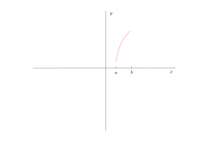
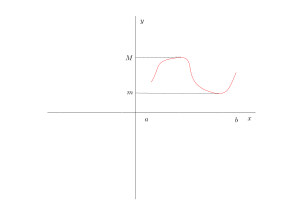

# 中值定理和导数的应用

## 中值定理

* 定理: 若$f(x)$在闭区间上连续,则$f(x)$在$[a,b]$上一定能取道最小值$m$和最大值$M$(端点$a,b$作为怀疑点):
  
  另一种情况是存在峰值:
  
  在这里引入极大值和极小值的概念

* 极大值和极小值:
  * 定义: $f(x)$在$x_0$的某个领域内$U(x_0,\delta_0)$内有定义,$\exists \delta_0>0$,当$x\in U(x_0,\delta_0)=(x_0-\delta_0,x_0+\delta_0)$,都有$f(x)\leq f(x_0),(f(x)\geq f(x_0))$,称为$f(x)$的极大值(极小值),$x_0$为**极大值点(极小值点)**
  * 极大值和极小值统称为极值极大值点和极小值点统称为极值点
  * **极值点一定在定义域的内部**(邻域隐含的条件)
  * 猜想:极值点位置的导数是0

* 定理(费马定理):若$f(x)$ 在$x=x_0$处取到极值且$f^{'} (x_0)$存在,则$f^{'}(x_0) =0$,反之不成立
  * 证明: 由$f(x)$在$x=x_0$处取到极值,不妨设$f(x)$在$x=x_0$处取得极大值,即存在
    $$
    \exists \delta >0,x\in(x_0-\delta,x_0+\delta),f(x)\leq f(x_0)\Leftrightarrow f(x)-f(x_0)\leq 0,f^{'} (x)\exists\\
    \Rightarrow f^{'}(x) =\lim_{x \rightarrow x_0}\frac{f(x)-f(x_0)}{x-x_0},(f(x)-f(x_0)\leq 0)\\
    (\text{性质: 若}\exists  \delta_0>0, x\in \overset{\circ}{U}(x_0,\delta_0)\Rightarrow f(x)\leq g(x), \text{且 }\lim_{x\rightarrow x_0}f(x)=A , \lim_{x\rightarrow x_0}g(x)=B,\Rightarrow A\leq B)\\
    f^{'}(x_0)=f^{'}_{-}(x_0)=\lim_{x\rightarrow x_0^-}\frac{f(x)-f(x_0)}{x-x_0}\\
    (x_0\in (x_0-\delta_0),\frac{f(x)-f(x_0)}{x-x_0}\geq 0,\lim_{x\rightarrow x_0^- }0=0\Rightarrow f^{'}_{-}(x_0)\geq 0 )  \\
    f^{'}(x_0)=f^{'}_+(x_0)=lim_{x\rightarrow x_{0}^{+} }\frac{f(x)-f(x_0)}{x-x_0}\leq 0\\
    \Rightarrow f^{'}(x_0)=0   
    $$
    反之不成立,反例:
    $$
        f(x)=x^{3},f^{'} (x)=3x^{2},f^{'}(0)=0   
    $$
    但是$f(0)=0$不是极值点
  * **这个条件是函数取到极值的必要条件**
  * 若$f^{'} (x_0)=0$称$x=x_0$是驻点,或者稳定点
  * 若$f(x)$在$x=x_0$取到极值
    * 若$^{'} (x_0)$存在,则$ f^{'}(x_0)=0  $
    * 若$f(x)$ 在$x=x_0$处不可导
    
    **极值点一定包含在区间内部的驻点和内部导数不存在的点之中**
    从而闭区间$[a,b]$上连续函数$f(x)$ 的最大值点和最小值点一定在端点或者取加内部驻点或者导数不存在点之中
  * 例: $f(x)=x^{3}+2x^{2}+x +1 ,x\in [-2,-1]$,求函数最大值和最小值
    $$
        \text{函数在闭区间上连续,说明函数一定有最大值和最小值: }\\
        f^{'}(x)=3x^{2}+4x+1=(x+1)(3x+1)  =0\\
        x_1=-\frac{1}{3},x_2=-1\notin [-2,-1]\\
        \text{内部没有导数不存在的点}\\
        f(-2)=-1,f(-1)=1\\
        min(f(x)=-1),max(f(x))=1
    $$

* 定理(罗尔定理): 
  * 引入:加什么条件能够使得$f(x)=0$有一个根:
    1. $f(x)\in C[a,b]$
    2. $f(a)=f(b)$(保证最大值和最小值不同时在端点取到)
    3. $\exists \xi \in(a,b)$使得$f(\xi)=M$为最大值
    4. $f(x)\in D(a,b)$表示区间上可导
    由费马定理$f^{'} (\xi)=0$